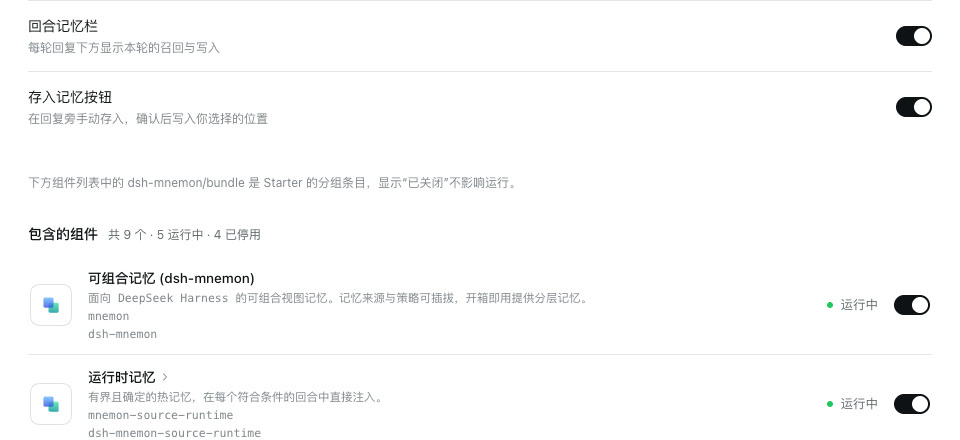
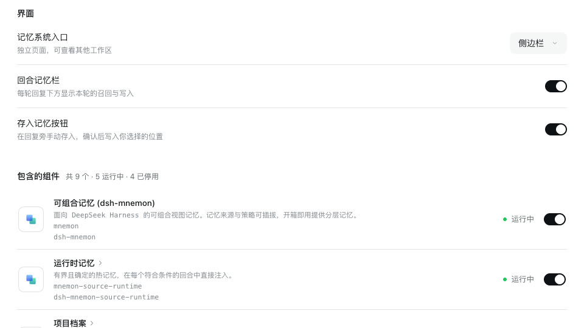
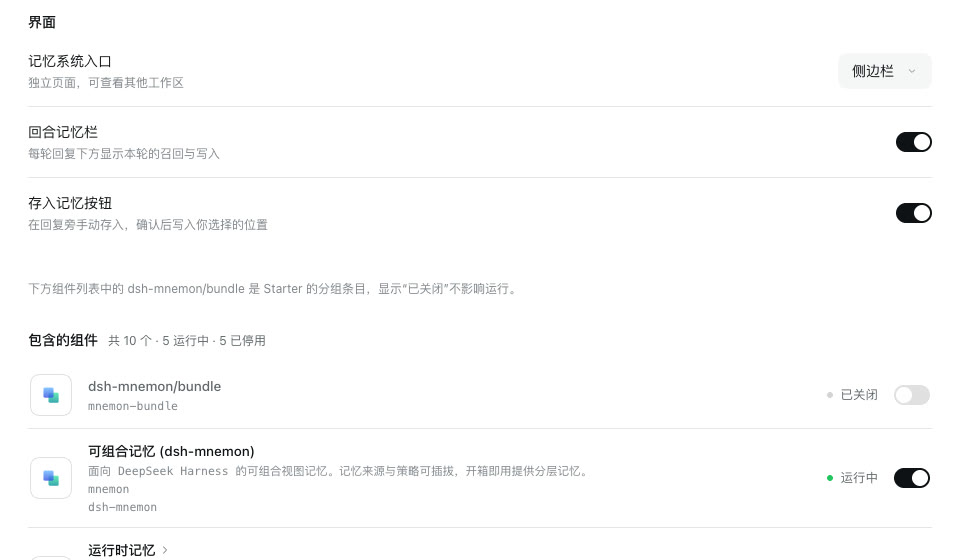

# dsh-mnemon on DSH 0.2.1-alpha.2

[简体中文](./README.zh-CN.md) | [Verification record](./verification.json)

DSH 0.2.1-alpha.2 (npm `alpha`) changes several things dsh-mnemon depends on. [#356](../issue-356-subagent-activation/README.md) adapted the memory subagents, and v0.5.26 shipped that. This record covers the rest: what else differs, what this change does about it, and what was run on 0.2.1-alpha.2 and on DSH 0.2.0-rc.2 (npm `latest` and `next`) to show that dsh-mnemon works on both.

Tested revision: the branch `claude/dsh-021-alpha2-adaptation`, on top of the [#359 fix](../issue-359-market-client-shim/README.md). The runs took place on 2026-10-10 (Asia/Shanghai):
- macOS 15.6 arm64 and Node 24.19.0;
- headless Chrome 154, zh-CN, light;
- DSH 0.2.1-alpha.2 and 0.2.0-rc.2, each in an isolated npm prefix;
- Mnemon CLI 0.2.10.

## What differs on 0.2.1-alpha.2

| DSH 0.2.1-alpha.2 | Effect on dsh-mnemon before this change | Now |
|---|---|---|
| `subagents.start` is gone; children start through `startActivation` | Every memory subagent failed | Fixed in v0.5.26 (#357) |
| The Plugins page no longer lists group rows | The note above DSH's component list explained a `dsh-mnemon/bundle` row that is not there | The note shows only while DSH lists the row |
| Before every step an Agent returns to its session's original directory when the current one is gone, and stops when that is gone too | Background memory tasks for a workspace whose folder was deleted or moved stopped | They keep that workspace and run from an existing directory |
| The plugin manager recomputes package routes from the selected bundles after each enable | None for users: a disabled bundle's dependency route is absent until it is enabled again, then returns to the same directory | The activation test accepts the absence and still requires the same directory |
| Tools mode `both` is gone; Code Mode refuses a filtered tool before dispatch | None: dsh-mnemon sets no tools mode | Covered by the real-host tests of #356 |
| The `{{cwd}}` prompt variable is gone | None: no dsh-mnemon prompt uses it | — |

### The note above DSH's component list

On DSH 0.2.0 and earlier, the component list on the dsh-mnemon page shows the Starter's grouping row `dsh-mnemon/bundle`, always off, and the configuration says why just above it. DSH 0.2.1-alpha.2 lists only the components, so the note pointed at nothing. The page's head controls see the rows DSH draws and report whether that row is among them; the configuration shows the note only then.

| DSH 0.2.1-alpha.2, v0.5.26 | DSH 0.2.1-alpha.2, this change | DSH 0.2.0-rc.2, this change |
|---|---|---|
|  |  |  |

On the pinned DSH 0.1.7-rc.2 the note and the row show as on 0.2.0-rc.2. A shell that draws the configuration without DSH's Plugins page now shows no note, since no component list follows it there.

### Background tasks in a missing workspace

A task Agent runs Runtime maintenance, Document archive, placement, metadata and the other background memory tasks outside any conversation. Its `cwd` is the caller's workspace, or the first workspace in DSH's registry when the caller has none, and Mnemon reads from it which workspace's memory the task works on. DSH 0.2.1-alpha.2 checks the working directory before each step, returns to the session's original directory when the current one is gone, and stops the Agent when that is gone too; for a task Agent both are the workspace folder. The task Agent's `cwd` is still chosen as before; only when that folder is missing does Mnemon set DSH's working directory to the first existing workspace in DSH's registry, or the directory DSH started in. Its children inherit both, as DSH's own subagents do. Where the folder exists, and on DSH 0.2.0 and 0.1.7, which have no working-directory service, nothing changes.

## Running the tests against an installed DSH

[`harness/installed-dsh-all.vitest.config.mjs`](./harness/installed-dsh-all.vitest.config.mjs) runs the root tests against an installed DSH. Every `@deepseek-ai/*` import, subpaths included, resolves inside the installation, and its packages are inlined, so the bare imports it lacks (`zustand`, `clsx`: DSH ships its client prebuilt) come from this repository. The six real-host specs that #356 adapts run from their adapted copies instead:

```sh
DSH_HOST_ROOT=<prefix>/lib/node_modules/@deepseek-ai/dsh DSH_VERSION=<version> \
  MNEMON_BUNDLE_TEST_PROFILE=<prefix>/lib/node_modules/@deepseek-ai/dsh \
  MNEMON_TEST_EXCLUDE=runtime-compaction-host,review-user-turn-host,review-evidence-host,agent-team-review-host,async-subagent-host,subagent-token-usage-host \
  pnpm exec vitest run --config docs/pr-assets/dsh-021-alpha2/harness/installed-dsh-all.vitest.config.mjs
node docs/pr-assets/issue-356-subagent-activation/harness/adapt-host-specs.mjs <specs>
DSH_HOST_ROOT=<prefix>/lib/node_modules/@deepseek-ai/dsh DSH_VERSION=<version> MNEMON_TEST_DIR=<specs> \
  pnpm exec vitest run --config docs/pr-assets/dsh-021-alpha2/harness/installed-dsh-all.vitest.config.mjs
```

`MNEMON_E2E_DSH=<prefix>/lib/node_modules/@deepseek-ai/dsh/lib/bin.js` points `pnpm e2e:serve`, `node scripts/verify-headless-profile.mjs` and `node scripts/verify-sync-git.mjs` at the installation, and `node --expose-internals tests/fixtures/bundle-activation.mjs <prefix>/lib/node_modules/@deepseek-ai/dsh manager` runs the Starter's activation contracts there.

## Results

### Tests against the installed hosts

| Check | DSH 0.2.1-alpha.2 | DSH 0.2.0-rc.2 |
|---|---|---|
| Root tests other than the six real-host specs | 1,816 passed, 6 skipped (127 files) | 1,816 passed, 6 skipped (127 files) |
| The six real-host specs, from the copies `adapt-host-specs.mjs` writes (17 tests) | 17 passed | 17 passed |
| Starter activation contracts: a cold start with nothing selected, another bundle stopped since startup, component and bundle switches that persist | passed | passed |
| `--check-declared-rows`: every listed component can be switched | passed | fails on the grouping row, the known listing issue of 0.1.7-rc.2 |
| Headless, with the default composition and with the three optional Strategies | passed | passed |
| A task Agent and its child for a deleted workspace folder ([probe](./harness/task-agent-cwd-host.probe.ts)) | v0.5.26: the task's first step fails with `working-directory: directory does not exist`, and so does starting its child. This change: both keep the deleted workspace as `cwd`; the task runs from the Host's directory and the child settles | Both versions: both keep the deleted workspace and run; DSH 0.2.0 does not check the directory |

`pnpm verify` and `verify:plugins` pass as well; they run on the pinned DSH 0.1.7-rc.2. Every named value import from DSH packages, such as the 20 from `dsh-client-ui-primitives`, exists in both releases.

### WebUI on 0.2.1-alpha.2

Each check ran in the real WebUI of the e2e fixture with `MNEMON_E2E_DSH` set to 0.2.1-alpha.2, following the [development guide](../../en/development/README.md#real-webui); only the model's choices are scripted.

| Area | Result |
|---|---|
| Plugins page | The configuration loads. DSH lists 9 components and no grouping row, and the note stays hidden. The head button opens the Memory System. Switching an optional Strategy or Project Documents applies at once, with no restart notice, and Status stays nominal. The main strategy moves between Layered and General and survives a reload. Each component row opens its own page. |
| Interface | The Memory System entry moves between the sidebar and a conversation tab. The turn memory bar and Save to memory switches hide and restore their controls. |
| Check versions | Lists dsh-mnemon, the Mnemon CLI and the 17 subpackages. |
| Conversation memory (`--docs-demo`) | A Documents search and two Memory Spaces recalls through the View tools, then a working-memory replace. The Memory System pages show the seeded documents, spaces, memories and entities. |
| General Strategy (`--general-strategy`) | Its protocol, the three Sources, a Runtime write, and recall from resident memory. |
| Save to memory (`--save-action`) | A save; an unchanged resend returns the first receipt; an edited resend saves again. |
| Idle review (`--idle-review`) | The reviewer commits a Document and a Runtime entry before the fixture's deliberate failure. Status shows both receipts, and the one-attempt cap holds. |
| USER.md compaction (`--profile-compaction`) | The third write compacts through a spawn child and succeeds. |
| Runtime Memory | Add, edit, delete and reload, with the capacity bars following. |
| Memory Spaces | A Native space created and activated, a fact written by the Mnemon CLI, Direct search, contents, entities and related memories. |
| Document archive (`--document-archive`) | An ineligible destination keeps the document active; after a rename it archives with a cold index. |
| ZIP backup | Export, then Safe import into the same profile and into a fresh one, where the payload is byte-identical. |
| Git sync | Off by default with only its title and switch; turned on, it shows the repository, GitHub sign-in and automatic backup. `scripts/verify-sync-git.mjs` with `MNEMON_E2E_DSH` set to 0.2.1-alpha.2 passes all 58 of its checks. |
| Without the Mnemon CLI (`--without-mnemon-cli`) | No Native card, the CLI listed as optional, the embedding test disabled, and a space can be created once another Provider is ready. |
| Remote management (`--trusted-host`) | Without the grant the page is read only and says so; with `remoteAccess: trusted-host` a change persists across a reload. |
| dshmarket | See the [#359 record](../issue-359-market-client-shim/README.md). |

No run logged a browser console error. Apart from the fixture's expected lines, the server logs were clean.

### Found on the way

- **Continuable memory tasks.** On 0.2.1-alpha.2 a memory task started under the conversation, such as idle review, stays in the conversation's subagent list as continuable. A message sent to it resumes it outside Mnemon's delegation. In the run its memory write then skipped idle review's single-layer check and was committed, and each time it stopped DSH told the conversation, which replied. DSH offers no way to remove the entry or refuse the resume, so [Compatibility](../../en/reference/compatibility.md#dsh-02) now says to leave these tasks alone.
- **Memory Spaces after a Provider is enabled.** On both hosts, enabling a Provider under Plugins left the Memory Spaces page with its old Provider list until Refresh, so a new space could not use it. Saving or switching a Provider now also reloads the Memory System's open page, as switching a component already re-read its status. Checked on both hosts: once Holographic was switched on under Plugins, Memory Spaces showed its space and offered it for a new one without Refresh, and once it was switched off, did neither.
- **The e2e fixture's Documents folder.** DSH creates its first-use workspace under the system Documents folder, which on macOS it asks the OS for, whatever `HOME` is. The fixture now sets DSH's `documentsDirectory` inside itself; before, choosing the workspace storage scope in a fixture wrote an empty `.mnemon` into the real Documents folder.
- Not specific to 0.2.1 and left for later: in the conversation-tab placement, Open Memory System does nothing on an empty new conversation; DSH's composer covers the storage note at the bottom of Status in that tab; Auto Capture's default guidance is English in the Chinese interface; a removal notice on Runtime Memory outlives leaving the page; the error for an ineligible archive destination is untranslated; an archive receipt names the space by its id; with no ready Provider the disabled Native option looks selected; the ZIP manifest records `pluginVersion` 0.1.0.

## Limits

- DSH 0.2.1-alpha.2 is an alpha; its APIs may change again before a release candidate.
- The model was a loopback stub that scripts only the model's choices; tools, subagents, storage and the WebUI were real.
- Only macOS was run. The DSH desktop app has no 0.2.1-alpha.2 build, so desktop windows were not checked on it.
