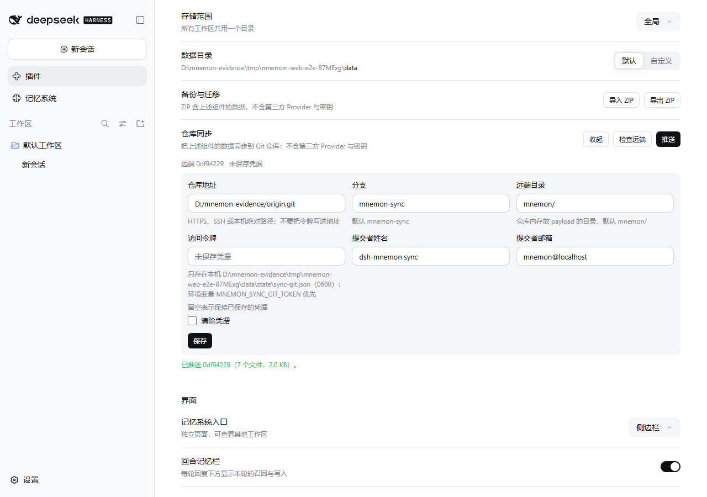
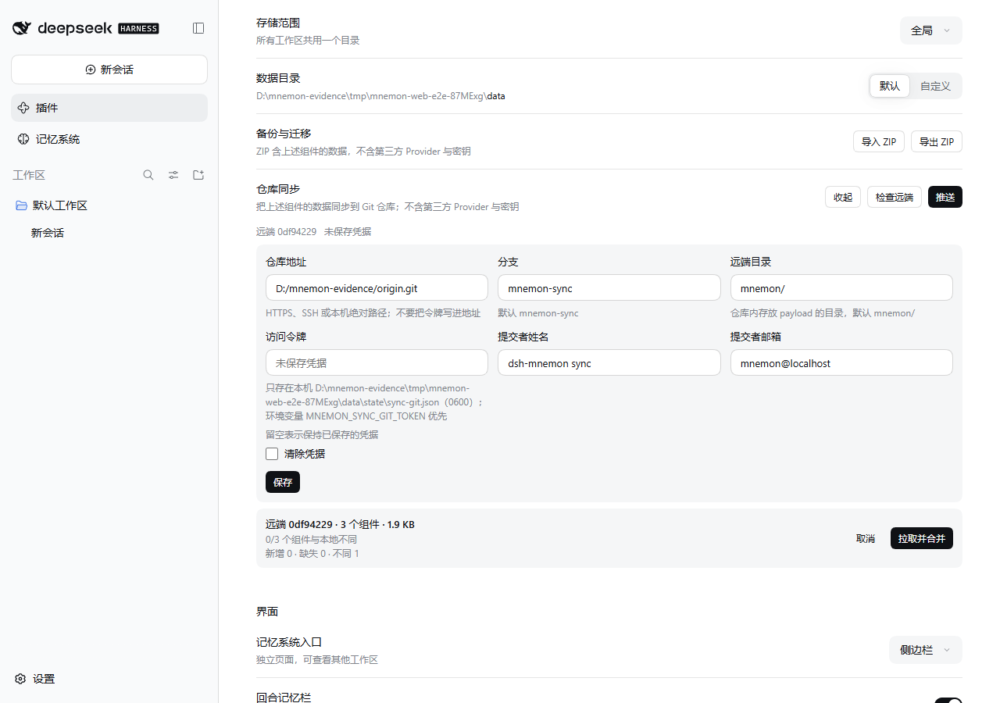
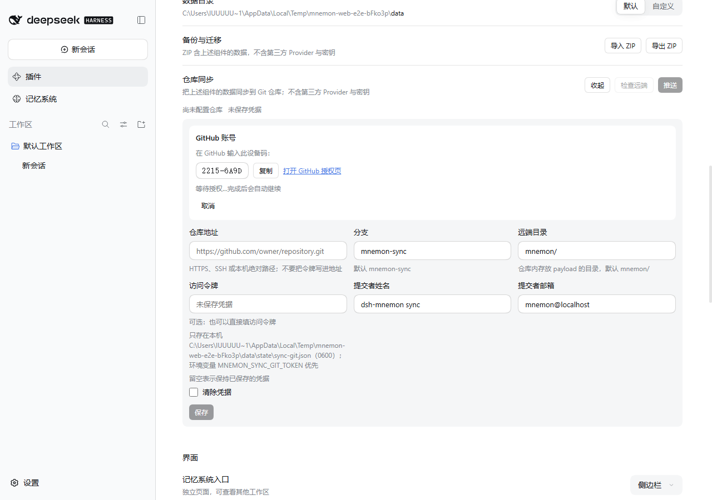
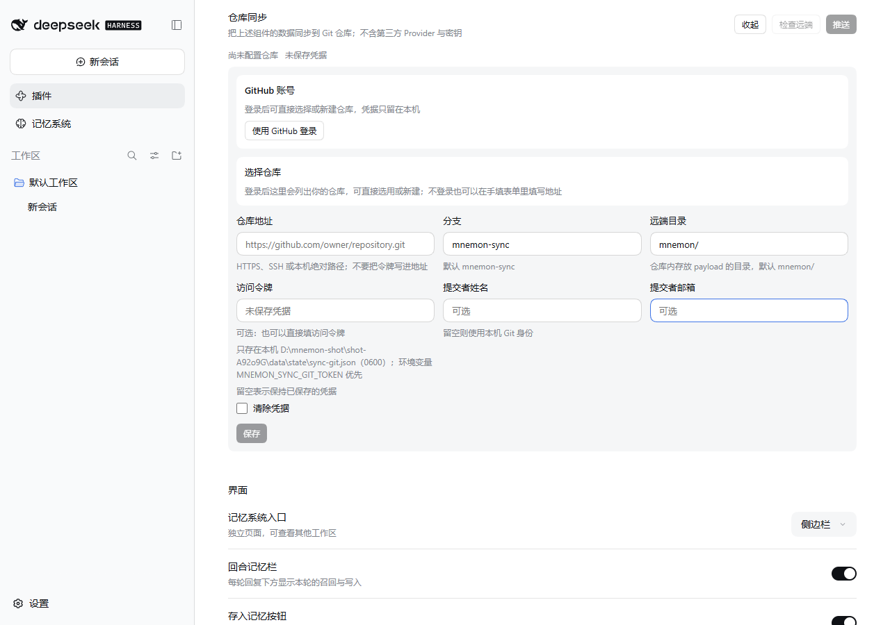

# Git repository sync

[简体中文](./README.zh-CN.md)

dsh-mnemon can publish its memory to a Git repository and restore it on another machine. The capability keeps the offline ZIP path as it is and adds a continuous one: the same Mnemon Pack payload, written as readable files, committed on a branch the user names. This record documents the frozen contract and the acceptance run behind it.

## What the channel adds

- Channel `/dsh-mnemon-sync` with twelve endpoints: `status`, `configure`, `push`, `preview`, `pull`, `github-status`, `github-start`, `github-poll`, `github-cancel`, `github-signout`, `github-repositories` and `github-create`.
- `push` exports the complete pack, commits it in the local mirror and pushes the branch. It requires `confirmed: true`; nothing pushes on a timer.
- `pull` reads the remote manifest and its SHA-256 inventory, previews the differences and, after confirmation, merges through the same importer Import ZIP uses. A manifest or checksum mismatch fails hard and imports nothing.
- The payload is the existing Mnemon Pack payload: one collector, one validator, one importer. The sync extension on `manifest.json` records the channel, branch, directory and push time, and a reader that does not know sync still reads a valid Mnemon Pack manifest.
- The payload is always a full Mnemon Pack: runtime, documents and memory-spaces, with the user profile inside runtime. It carries memory content only — configuration belongs to the profile layer and stays on the machine that set it, so a second machine keeps its own settings rather than inheriting a path that only exists on the first. A pack manifest's `scope` is `full` or exactly one component, so a persistent component selection cannot be represented and none is stored. Component filtering is a one-off, optional `components` parameter on pull.
- `push` merges the remote pack before it exports: it imports what the remote holds, then exports the merged result, and the response reports the merge (`merged.commit`, `merged.machine`, `merged.components`, `merged.summary`, `merged.tombstones`). A runtime entry deleted here is recorded as a tombstone at export time, so importing an older pack does not bring it back.
- Both directions require `writeEnabled`; a read-only deployment refuses push and pull with the same message Import ZIP uses.
- **Sign in with GitHub** is the primary credential. The form runs GitHub's OAuth device flow: it shows the one-time code, links to `https://github.com/login/device`, and polls at the interval GitHub returns. The grant is stored through DSH's credentials service under the record key `dsh-mnemon/github` and never reaches the browser. The service is read with `ctx.get('credentials')`, not `inject`, so a profile that mounts no provider still loads the plugin and reports the login as unavailable.
- **Your repositories** lists what the signed-in account may push to (private marked, no-push disabled) and **Create repository** makes a new one, private by default and with an initial commit so the first push has a branch to publish to. Selecting either writes the clone URL into the same `repoUrl` field the manual form edits.
- The token field stays as the fallback and is optional. Status and configuration responses describe the credential (`hasToken`, `credentialSource`, `credentialLogin`) and never return its value, and a failure message is masked.

## Remote layout

Files sit under `<subdir>/` on the configured branch, `mnemon/` on `mnemon-sync` by default:

```text
<branch>:<subdir>/
+-- manifest.json       # Mnemon Pack manifest plus the sync extension
+-- checksums.json      # SHA-256 per payload file, as in the ZIP
+-- payload/
    +-- runtime/{memories.json,USER.md,MEMORY.md}
    +-- documents/{index.json,active/<id>.md,archived/<id>.md}
    +-- data/{.dsh-memory-bodies.json,<bodyId>/mnemon.db}
```

The extension is `{"sync": {"channel": "git", "branch": "mnemon-sync", "subdir": "mnemon/", "pushedAt": "..."}}`. A payload without it is still accepted on pull. The remote holds the current state at a stable path; retention is the branch's own Git history.

## Configuration

Configuration lives in `<storageRoot>/state/sync-git.json` with mode `0600`. It is not part of Config, it belongs to one storage root, and it never travels through a settings RPC or a profile patch.

| Field | Default | Notes |
|---|---|---|
| `repoUrl` | - | `https://`, `ssh://`, `git@host:path` or an absolute local path; the token is never embedded in it. The only field without a default |
| `branch` | `mnemon-sync` | validated as a Git branch name; an empty value restores this default |
| `subdir` | `mnemon/` | relative, no `..`, no absolute path; an empty value restores this default |
| `token` | - | optional fallback, HTTPS remotes only; `MNEMON_SYNC_GIT_TOKEN` overrides it and it is never returned by RPC. GitHub sign-in is the preferred credential and lives outside this file |
| `authorName` | `dsh-mnemon sync` | commit identity for the sync branch, optional; empty means the `user.name` of this machine |
| `authorEmail` | `mnemon@localhost` | commit identity for the sync branch, optional; empty means the `user.email` of this machine |

There is no `components` field. Mnemon Pack validates a manifest `scope` as `full` or exactly one component, so an arbitrary subset has no representation in the format and the sync payload is always the full pack; the only component filter is the optional one-off `components` parameter on pull. The mirror under `<storageRoot>/state/sync/git` is a disposable Git work tree; the storage root is never made a Git work tree, and `state/` is not part of any pack component, so the mirror cannot sync itself. Git runs through the Host's existing `runProcess` with an argument array and `shell: false`; no new dependency and no shell string interpolation.

## Verification

This section is the record of the acceptance run, not a plan. It was run on Windows 11 with Node 26.0.0 and Git 2.55.0.windows.5, against the revision the pull request carries. The harness is `scripts/verify-sync-git.mjs`, run as `node scripts/verify-sync-git.mjs` (`pnpm run e2e:sync` runs the same script; on this machine the pnpm wrapper is affected by a `TEMP` on another drive, while running it through Node is not); it builds two disposable storage roots, installs the plugin into two disposable `DSH_HOME` profiles, starts two real `dsh web` instances, exchanges each launch token for its browser cookie, and drives `/dsh-mnemon-sync` and `/dsh-mnemon-write` over loopback HTTP with the same envelopes the browser sends. The only stand-in is the model endpoint, which never receives a request.

```sh
pnpm run build && pnpm --workspace-concurrency=4 -r build
node scripts/verify-sync-git.mjs
```

The run reported:

```text
1. One instance publishes the whole pack to a real repository
  ok   a fresh storage root reports Git and an unconfigured remote
  ok   the configuration path lives inside the storage root
  ok   a repository alone is enough: branch, directory and author keep their defaults
  ok   an empty author clears the identity so Git uses the one on this machine
  ok   an empty branch and directory fall back to the defaults
  ok   the working memory accepted one entry through the write channel
  ok   the configured remote is reachable and still has no branch
  ok   an unconfirmed push is refused
  ok   push committed and published one pack
  ok   the pack holds every component
  ok   the commit carries the identity Git was left with
  ok   the branch holds the manifest, the checksums and the payload
  ok   the published working memory carries the entry
  ok   the manifest declares the pack and its channel
  ok   the mirror lives under the storage root and not at its top level
  ok   a repeated push publishes nothing new
  ok   the branch holds exactly one commit

2. A second instance previews and imports the same branch
  ok   the second instance reaches the same defaults from a repository alone
  ok   preview reports the published commit and its manifest
  ok   preview reports the working memory as changed against an empty root
  ok   preview imported nothing
  ok   pull imported the published commit through the pack importer
  ok   the second machine now holds the working memory and the profile

3. A tampered payload fails hard and imports nothing
  ok   the checksum failure names the changed file
  ok   the tampered payload was not imported

4. A token never reaches a response, a file, or the mirror
  ok   configure names the credential without carrying it
  ok   status names the credential without carrying it
  ok   the token is stored in the 0600 state file
  ok   an unreachable remote is reported without leaking the token
  ok   a failed push never echoes the token
  ok   the token never reaches the mirror

5. Read-only work still answers while every write stays gated
  ok   an unknown endpoint is a bad request

6. GitHub sign-in answers over the channel without a browser
  ok   the sign-in surface reports what this Host can do
  ok   the store is mounted and the account is still signed out
  ok   cancelling a flow that never started leaves the account signed out
  ok   both instances shut down on the polite signal

Git sync end-to-end verification passed.
```

The same channel through the real WebUI, rather than the harness: a real `dsh web` instance served the storage page, the repository was configured through the form, one entry was written through the normal write path, and the branch was published with the button. All four images come from that session, and none of them shows a credential, an account name or a repository name; the absolute paths in them belong to the disposable storage roots of one acceptance instance.

| Save and push from the storage page | Reading the remote back before importing anything | Signing in to GitHub from the same page | The defaults and the optional fields while signed out |
|---|---|---|---|
|  |  |  |  |

The page reported `已推送 0df94229（7 个文件，2.0 KB）。` after the push, and the branch held `mnemon/payload/runtime/USER.md` with the entry that had been written a moment earlier. `检查远端` then reported `远端 0df94229 · 3 个组件 · 1.9 KB`, `0/3 个组件与本地不同` and `新增 0 · 丢失 0 · 不同 1` without importing anything: the merge happens only after `拉取并合并`. The fixture runs in Chinese, which is why the copy in the images is Chinese.

The fourth image is the same form while signed out: the `选择仓库` block is still visible and says that a sign-in lists the repositories while an address typed below works without one; `分支` and `远端目录` are prefilled with `mnemon-sync` and `mnemon/` and say `默认 mnemon-sync` and `仓库内存放 payload 的目录，默认 mnemon/` under them; `提交者姓名` and `提交者邮箱` both show the `可选` placeholder, and the name carries `留空则使用本机 Git 身份`.

What the run establishes, beyond the unit suites:

- One real instance wrote the working memory and the user profile through `/dsh-mnemon-write`, pushed through `/dsh-mnemon-sync/push`, and the bare repository then held `mnemon/manifest.json`, `mnemon/checksums.json` and `mnemon/payload/runtime/{memories.json,USER.md,MEMORY.md}` on `mnemon-sync`, with the entry readable in `git show mnemon-sync:mnemon/payload/runtime/MEMORY.md`.
- A second instance with its own `DSH_HOME` and storage root previewed the branch, imported it after confirmation and then held both the working memory entry and the profile on disk, so the branch really is portable between machines.
- Repeating the same push reported `committed: false`, `pushed: false` and `the branch already holds this payload`, and the branch stayed at one commit. This is the case a fixed test clock used to hide; the acceptance run uses the real clock.
- Tampering with one payload file made both preview and pull fail with `the remote Mnemon payload failed its checksum: payload/runtime/MEMORY.md` and left the second machine's files untouched.
- The token appeared only in the `0600` state file. Responses, failure messages and the mirror's Git configuration never contained it.
- The device flow was driven end to end over the channel in `tests/sync-rpc.spec.ts` with a stubbed GitHub: `github-start` returned the user code and the verification URL, `github-poll` returned `success` with the login, and the resulting access token appeared in no answer — only `credentialSource: 'github'` and `credentialLogin: 'octocat'` did.
- Unconfirmed push and pull were refused with `Publishing the sync branch requires confirmation` and `Importing the remote Mnemon payload requires confirmation`, and an unknown endpoint returned `bad-request` with `unknown sync endpoint: nope`.
- The sign-in block was then driven through the real page rather than the harness: `github-start` answered with a live device code and the verification link, and the page repeated `github-poll` seven times in thirty-two seconds, 5.39 s, 5.38 s, 5.40 s, 5.38 s, 5.41 s and 5.38 s apart, which is GitHub's five-second interval plus the round trip. No answer carried a token.
- The form shows the `选择仓库` block while signed out too: it renders as soon as `github-status` reports sign-in available, and without a sign-in it replaces the list and the create button with one sentence while the hand-typed form stays usable.
- A repository address alone configures the sync: `configure` carrying only `repoUrl` leaves `branch`, `subdir`, `authorName` and `authorEmail` at their defaults; an empty `branch` or `subdir` restores the default, and an empty `authorName` or `authorEmail` lets Git use the identity of the machine. The commit author is therefore exactly what `git var GIT_AUTHOR_IDENT` reports, because Git rejects an empty `-c user.name=` value.
- With an account signed in, the block listed that account's repositories, marked the private ones and disabled the ones without push access, and choosing one wrote its URL into the repository field. A device code left over from an earlier session is not shown once the account is signed in; the block reports `Signed in as @…` instead, and a regression test holds that case.

Two behaviors the run recorded that are not defects, and are worth knowing before reading a real remote:

- A fresh storage root still exports an empty `documents/index.json` and an empty `payload/data/.dsh-memory-bodies.json`, so those two components can report `changed: false` against an empty root while runtime reports `changed: true`. Preview compares bytes, and two empty indexes are the same bytes.
- The importer rebuilds `memories.json` with its own key order, so a machine that pulled a branch and then pushes it again can produce a commit whose bytes differ while its content does not. The payload comparison ignores only the two manifest timestamps, not field order.

The automated coverage runs in `pnpm test`: `tests/sync-config.spec.ts` for reading, writing, mode `0600`, redaction and validation; `tests/git-sync.spec.ts` for init, push, a second-machine pull, manifest and checksum rejection, subdir and branch validation, the no-silent-empty-payload case and the repeat-push case on a moving clock, skipped when Git is absent; `tests/github-auth.spec.ts` for the device flow against a stub credentials port and a queued stub `fetch` (start, pending, `slow_down`, success, expiry, denial, error, cancel, sign-out, listing and creation validation); and `tests/sync-rpc.spec.ts` for endpoint validation, the `writeEnabled` gate, token redaction, error masking, a full sign-in whose token appears in no answer, and the denied remote projection.

## Limits

- No automatic or scheduled pushes. Push is a user action and always asks first.
- Encrypted snapshots, WebDAV and snapshot directories with a retention window are out of scope.
- Only memory travels: the payload carries no DSH configuration, no credentials and no session history.
- A push without remote credentials still commits locally and reports that the push was skipped; the branch reaches the remote on the next push with credentials.
- Credentials resolve in this order: `MNEMON_SYNC_GIT_TOKEN`, the token in `state/sync-git.json` at mode `0600`, then the grant GitHub sign-in wrote into DSH's credentials service. Whether the local token field should be dropped now that the service is wired is a maintainer decision recorded in the plan.
