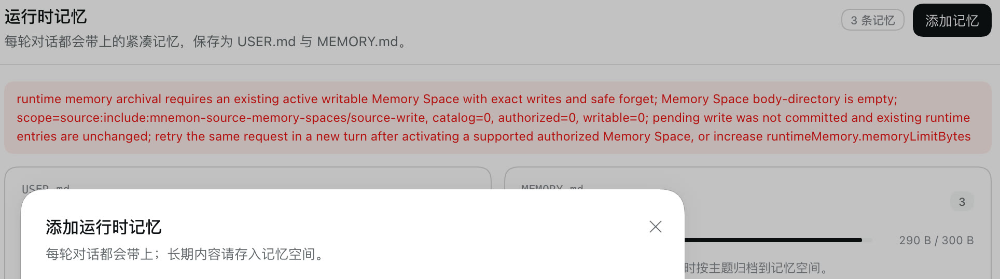
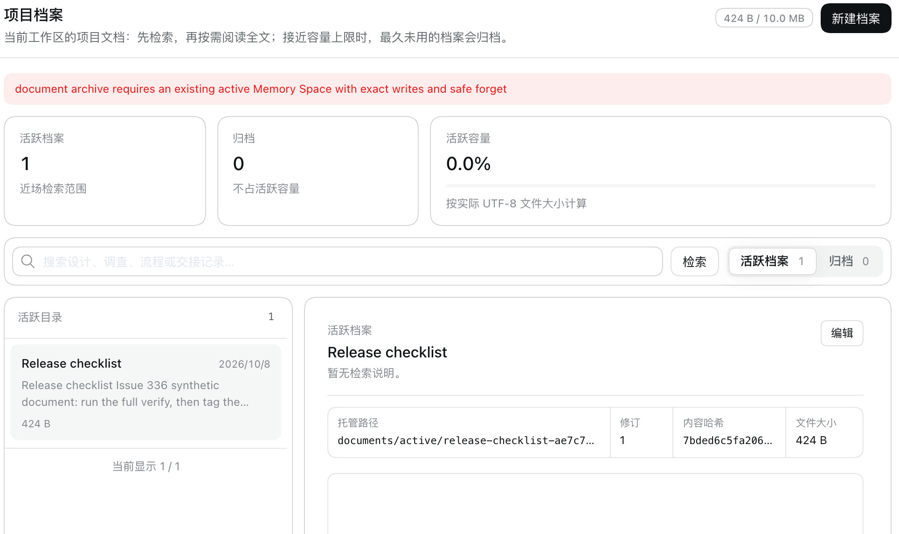
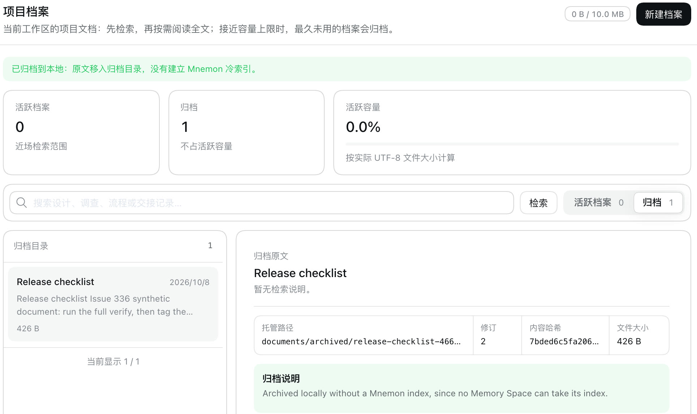

# Memory without a Memory Space — issue #336

[简体中文](./README.zh-CN.md) | [Issue #336](https://github.com/omdsh-dev/dsh-mnemon/issues/336) | [Verification record](./verification.json)

MEMORY.md makes room by archiving entries into a Memory Space before it compacts. On the reporter's machine there was no Mnemon CLI and no other Provider, so no space existed or could be created, and every write that no longer fit was refused. Project Documents refused the same way when they needed room or an archive. With the fix, memory keeps working without a Memory Space: what no longer fits moves to a local archive, and nothing is lost.

Baseline: main `2296898d` (dsh-mnemon 0.5.24). Fix: `b3e478a9`. The runs use macOS 15.6 arm64, Node 24.19.0 and DSH 0.2.0-rc.2 (npm `latest` and `next`) in an isolated prefix.

## Method

`pnpm e2e:serve` ran with one `mnemon` configuration row: a `cliPath` that points at a missing file, which hides any installed Mnemon CLI as `--without-mnemon-cli` does, and a 300-byte working memory. No other Provider was connected. The same script ran on the fix and, with main's versions of the source files the fix changes swapped into the build, on the baseline:

1. open **记忆系统** (Memory System), then **运行时记忆** (Runtime Memory), and add four working-memory entries; the fourth does not fit;
2. read the runtime data directory;
3. open **项目档案** (Project Documents), create a document and **归档** (Archive) it.

## Before and after

| The fourth entry on main | With the fix |
|---|---|
|  |  |

| Archiving a Document on main | With the fix |
|---|---|
|  |  |

| | Main | Fix |
|---|---|---|
| The working-memory write that does not fit | refused, `runtime memory archival requires an existing active writable Memory Space …; Memory Space body-directory is empty` | saved; 2 older entries moved to `runtime/archived/` |
| Working memory afterwards | 3 entries, 290 B of 300 B, the new one missing | 2 entries, 192 B, the new one and the oldest one |
| Local archive | none | `runtime/archived/MEMORY.md` with the 2 entries, word for word, plus `memories.jsonl` |
| Archiving a Project Document | refused, `document archive requires an existing active Memory Space …` | archived locally; the original stays readable under the archive tab |
| Browser console errors | none | none |

## Cause and fix

Capacity maintenance archived every MEMORY.md entry it could move into a Memory Space, then compacted. With no space that could take them, it refused, whatever the reason: no Provider ready, the layer switched off, no active space, or only Providers without exact writes. Project Documents needed a Memory Space for their cold index in the same way.

When no Memory Space at all can take the archive, the Host now asks the Runtime Source to compact with `archive: 'local'`. Inside the same lock it appends the committed entries that compaction leaves out to `runtime/archived/` (`memories.jsonl` to restore from, `MEMORY.md` to read), and then commits the compacted store. A failure in between leaves an entry in both places, never in neither. A Project Document is archived locally the same way and keeps its original. When a Memory Space can take the archive, nothing changes. A space that exists but lies outside the current View's write scope still refuses, so the retry in a new turn that the error asks for can archive into it.

The Memory Spaces layer also stops promising what it cannot do:

- With no ready Provider, it offers Agents no remember or manage-spaces Action.
- A Mnemon Native space counts as active only while its CLI is found. The Source revision changes only in that case.
- The Layered strategy names `mnemon_recall` and archiving into Memory Spaces only while Memory Spaces offers recall. With all three layers in place, the guidance is byte for byte what it was.
- `mnemon_status` adds a notice while no Memory Space exists.

## Automated checks

- `tests/layer-combinations.spec.ts` runs the layers to their limits:
  - Memory Spaces ready, with only an inactive space, without a ready Provider, switched off, and not installed: MEMORY.md full through the Agent tool and the web page, then the View each state offers.
  - The four states without a Memory Space: Project Documents full, and an explicit archive.
  - All eight on and off combinations of Runtime Memory, Project Documents and Memory Spaces.
  - In every case nothing that did not fit is lost, and no state needs model work to make room.
- `plugins/dsh-mnemon-source-runtime/tests/controller.spec.ts`: the local archive takes exactly the entries compaction leaves out, appends later batches under one header, and is written only when asked.
- `plugins/dsh-mnemon-strategy-default-three-tier/tests/strategy.spec.ts`: the guidance with Memory Spaces to recall from is unchanged; without them it names neither `mnemon_recall` nor archiving into Memory Spaces.
- Tests that asserted the old refusals now assert the local archive, still with no write to a read-only, inactive or unsupported space. The issue 250 tests, where a space exists outside the View's scope, keep their refusal.

## Limits

- Agents cannot recall from the local archive. It keeps the entries for the user, and for a later import into a Memory Space.
- Mnemon Packs do not carry the local archive yet. Importing a Pack leaves it in place.
- Save to memory in a conversation still needs a Memory Space; a separate change lets the dialog write to working memory directly.
- Screenshots show DSH's default light theme and Chinese UI only.
