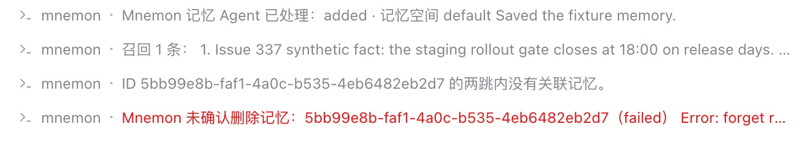
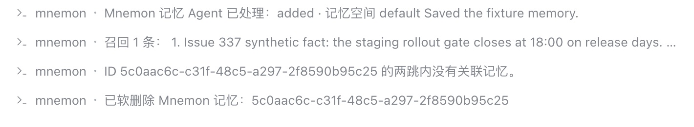

# Forgetting a memory by its exact id — issue #337

[简体中文](./README.zh-CN.md) | [Issue #337](https://github.com/omdsh-dev/dsh-mnemon/issues/337) | [Verification record](./verification.json)

An Agent that wrote a memory could not remove it again: `mnemon_forget` failed with `forget requires evidence already admitted by this View`, whatever id and Memory Space it named. `/mnemon forget <ID>` failed the same way for the user. With the fix, the memory named by its exact id is forgotten, and only that one.

Baseline: main `2296898d` (dsh-mnemon 0.5.24). Fix: `cd66723a`. The runs use macOS 15.6 arm64, Node 24.19.0, DSH 0.2.0-rc.2 (npm `latest` and `next`) in an isolated prefix, and Mnemon CLI 0.2.10.

## Method

`MNEMON_CLI_PATH=/opt/homebrew/bin/mnemon pnpm e2e:serve --exact-id` starts the real WebUI with a disposable profile and Mnemon Native. Only the delegated workers' decisions are scripted: the remember worker writes the content it is given, and the forget worker calls `mnemon_forget` with the exact id it is given. Commands, tools, Views and the Native store are real. The same script ran on the fix and, with main's Memory Spaces Source and Mnemon Native driver swapped into the build, on the baseline. In one conversation:

1. `/mnemon remember Issue 337 synthetic fact: the staging rollout gate closes at 18:00 on release days.`
2. `/mnemon recall staging rollout gate`, which prints the memory's id;
3. `/mnemon related <ID>`;
4. `/mnemon forget <ID>`, then the Native store's status, read-only.

## Before and after

| On main | With the fix |
|---|---|
|  |  |

| | Main | Fix |
|---|---|---|
| `/mnemon related <ID>` | no related memories within two hops | the same |
| `/mnemon forget <ID>` | **未确认删除** (not confirmed), `forget requires evidence already admitted by this View` | **已软删除** (soft-deleted) |
| Native store after forget | 1 insight, 0 deleted | 0 insights, 1 deleted |
| Browser console errors | none | none |

## Cause and fix

Forget, link and related-memory traversal act only on ids the current View admitted, that is, evidence its recall actually returned. `mnemon_forget` and `/mnemon forget <ID>` do not forget in the caller's View: they hand the request to a worker Agent, whose View is new and has recalled nothing. That worker has only the id, so no recall query could admit it, and the action could never run. `/mnemon related <ID>` does not hit this: it runs in the View that the preceding `/mnemon recall` admitted the id into.

When an id is not evidence of the View, the Source now asks the Providers that can look ids up, through the new optional `get(body, id)`, among the spaces the View can read. It admits the memory and acts only when exactly one space holds the id; an id no space holds, or two spaces hold, is refused, and naming the space settles the second case. A request that names its space still reaches a Provider that cannot look ids up, and that Provider's own call decides whether the id exists. Evidence the View returned decides first, exactly as before. Beyond it, an action now needs the exact id of a memory in a space the View can read, rather than a recall in the same View; which spaces the View can read is unchanged. Mnemon Native looks ids up with `mnemon --readonly show`, which leaves access counts and the operation log untouched; an unknown or forgotten id reads as absent. Links and related-memory traversal resolve ids the same way. Tool descriptions are unchanged.

## Automated checks

- `plugins/dsh-mnemon-source-memory-spaces/tests/source.spec.ts`, *acts on a memory named by exact id that this View has not returned*: forget finds `written` in its one space; refuses `missing` and the ambiguous `twin`; forgets `twin` when the space is named; traversal and links resolve the same way. It fails on main with the reported error.
- The existing *admits only evidence actually returned under the View budget* test still refuses traversal and forget for an id outside the View's evidence when its Provider cannot look ids up and the request names no space.
- `plugins/dsh-mnemon-provider-mnemon-native/tests/provider.spec.ts`: `get` reads with `--readonly show`, maps "no rows" to absent and passes other failures on.

## Limits

The workers are scripted, so the run checks the Host and Source path rather than a model's choices. Providers other than Mnemon Native do not implement `get` yet; for them an id outside the View's evidence needs its space named. Screenshots show DSH's default light theme and Chinese UI only.
