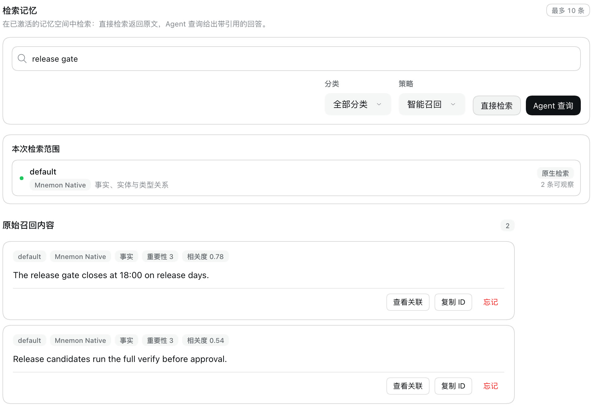
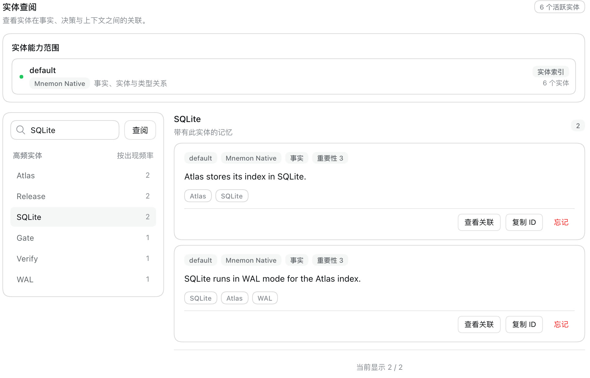

# Searching memory without recording it — issue #338

[简体中文](./README.zh-CN.md) | [Issue #338](https://github.com/omdsh-dev/dsh-mnemon/issues/338) | [Verification record](./verification.json)

Mnemon Native records every recall: it adds a row with the query text to the store's operation log and counts its hits as accessed. Mnemon's retention reads those counts, and never prunes a memory accessed three times. The issue reports this for the Mnemon CLI's own commands, which dsh-mnemon does not control. dsh-mnemon controls which of its reads go through that path. An Agent recalling memory is a use. The Memory System's own searches only look, yet they were recorded the same way. With the fix they read a snapshot and leave the store unchanged.

Baseline: main `2296898d` (dsh-mnemon 0.5.24). Fix: `f60990bf`. The runs use macOS 15.6 arm64, Node 24.19.0, DSH 0.2.0-rc.2 (npm `latest` and `next`) in an isolated prefix, and Mnemon CLI 0.2.10.

## Method

`pnpm e2e:serve` ran with Mnemon Native and a store `default` that holds four memories with entities, written through the Mnemon CLI before the Host started. After each step, `mnemon --readonly status` read the store's `oplog_count`; that read records nothing. The same script ran on the fix and, with main's versions of the files the fix changes swapped into the build, on the baseline.

| The Direct search measured | The Entities page measured |
|---|---|
|  |  |

## Before and after

Rows each step added to the operation log:

| Step | Main | Fix |
|---|---|---|
| Open Memory System, then Memory Spaces | 0 | 0 |
| **直接检索** (Direct search) for `release gate` | 1 | 0 |
| **查看关联** (View related) on the first result | 0 | 0 |
| **实体** (Entities): select SQLite | 0 | 0 |
| **查找相关记忆** (Find related memories) for SQLite | 1 | 0 |
| A conversation turn whose model does not recall | 0 | 0 |
| `/mnemon recall release gate` | 1 | 1 |

`mnemon log` afterwards on main lists three recalls with their queries (`q=release gate`, `q=SQLite`, `q=release gate`); with the fix it lists one, from `/mnemon recall`. The pages show the same results on both builds.

## Cause and fix

**Direct search** on Memory Spaces and **Find related memories** on the Entities page go through the same Source search as Agent recall, and Mnemon Native ran each as a plain `mnemon recall`.

These searches now set `SearchRequest.inspect`. Mnemon Native answers them with `mnemon --readonly`, which reads a snapshot, bumps no access counts and writes no log row; the Memory System's lists and graph already read this way. Agent recall, `/mnemon recall` and **Agent 查询** (Ask Agent) are uses and record as before, so Mnemon's retention keeps seeing the memories Agents rely on. Other Providers receive the flag too and can make the same distinction. The Provider guide now says what Mnemon Native records.

Two reads stay as they are:

- **View related** runs `mnemon related`, which records nothing; it added no row on either build.
- The Host's checks of its own writes while archiving (whether a Document's index already exists, and the search that verifies a skipped write) keep reading the live store. Mnemon documents its snapshot as unfit for a store another process is changing, and these checks must see the latest writes.

## Automated checks

- `plugins/dsh-mnemon-provider-mnemon-native/tests/provider.spec.ts`: a search with `inspect` runs with `--readonly`; without it, it runs as before.
- `plugins/dsh-mnemon-source-memory-spaces/tests/source-io.spec.ts`, *passes an inspection on to the Provider and leaves Agent recall a use*: a management search passes the flag through; a search without it and an Agent's recall through its View do not.
- `tests/client.spec.tsx` and `tests/entity-index.spec.ts` in the same plugin: the page's searches and the Entities page's related recall are inspections.

Each fails on main.

## Limits

- A snapshot can miss a write made while another Mnemon process has the store open, until that process exits, typically within seconds. The Memory System's lists and graph already behave this way.
- Mnemon keeps the latest 5,000 operations in its log. The log of the Mnemon CLI's own commands, and the query text it stores, belong to Mnemon and are unchanged here.
- Screenshots show DSH's default light theme and Chinese UI only.
