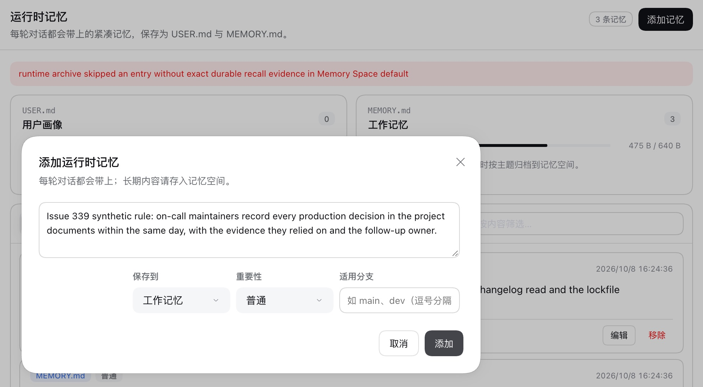
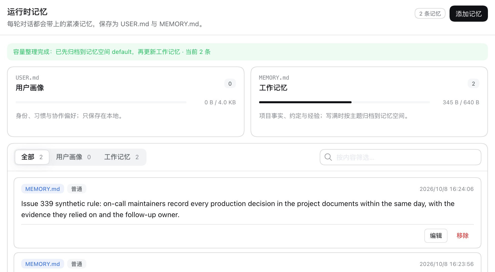

# Archiving working memory that a space already holds word for word — issue #339

[简体中文](./README.zh-CN.md) | [Issue #339](https://github.com/omdsh-dev/dsh-mnemon/issues/339) | [Verification record](./verification.json)

When MEMORY.md is full, the Host copies its entries into a Memory Space before compacting it. In the issue, every attempt failed with `runtime archive skipped an entry without exact durable recall evidence`: the space already held exact copies of most entries, the attempt removed what it had just written, and MEMORY.md stayed full. The reporter first saw four timeouts on the same path, with an external embedding service. With the fix, those entries are archived from the provider's own receipt, without searching for them.

Baseline: main `2296898d` (dsh-mnemon 0.5.24). Fix: `0064b658`. The runs use macOS 15.6 arm64, Node 24.19.0, DSH 0.2.0-rc.2 (npm `latest` and `next`) in an isolated prefix, and Mnemon CLI 0.2.10.

## Method

`MNEMON_CLI_PATH=/opt/homebrew/bin/mnemon pnpm e2e:serve --archive-copies` starts the real WebUI with a disposable profile. Before the Host starts, it writes three working-memory entries (475 of 640 bytes) and an exact copy of each into the Native Memory Space `default`, as an earlier failed attempt leaves them. Embeddings go to a loopback service that answers after 12 seconds; the Mnemon CLI keeps its default 10-second timeout. The same script ran on the fix and, with main's coordinator and Memory Spaces runner swapped into the build, on the baseline:

1. open **记忆系统** (Memory System), then **运行时记忆** (Runtime Memory);
2. **添加记忆** (Add memory): the 182-byte entry the fixture prints, saved to working memory;
3. read the Native store with `mnemon --readonly recall --basic`.

## Before and after

Working memory before the add, on both builds:

| Adding the entry on main | With the fix |
|---|---|
|  |  |

| | Main | Fix |
|---|---|---|
| Result | `runtime archive skipped an entry without exact durable recall evidence in Memory Space default` | **容量整理完成** (Capacity maintenance complete): archived to `default`, then the entry added |
| Time from Add to result | 10.2 s | 0.3 s |
| Embedding requests | 1, the first verification recall, cut off by the 10-second timeout | 0 |
| Working memory afterwards | unchanged, 475 B of 640 B, the entry not added | 345 B of 640 B, 2 entries including the new one |
| Native store | 3 insights before and after | 3 insights before and after, no duplicate written |
| Browser console errors | none | none |

## Cause and fix

The archive imports the entries with Mnemon Native's batch writer. That writer first reads the space and skips an entry whose exact text it already holds, and its receipt names that memory: its id and its stored text. The Host discarded both and verified each skipped entry with a ranked recall of its first 500 characters, one entry at a time, requiring an exact match among the results. The Memory Spaces search turns a failed Provider call into an empty result, so one recall that timed out, here on the embedding service, failed the whole archive; a recall that ranked the copy below the quality policy's cut would have done the same. The failed attempt then removed the entries it had just created, which is why every retry ended in the same state.

A skipped receipt that carries the stored memory's id and exactly the entry's text is now the evidence for that entry. A receipt without them, for example from a Provider that reports only an id, is still verified by search, and that error now says whether the search was unavailable or returned no exact copy. A Document archive reads a skipped index receipt the same way. A Mnemon CLI timeout names its command, such as `mnemon import did not respond within 10000ms`, so a slow path is easier to tell from a broken one.

## Automated checks

- `tests/subagent.spec.ts`, *takes a skipped receipt that names the exact stored memory as its evidence, without a search*: two skipped entries and one new one are archived with the receipts' ids, without a search. On main it fails with the reported error.
- *still searches when a skipped receipt does not carry the exact text, and says what the search found*: a semantic match is not taken as a copy, the new entry is removed again and working memory is untouched; the error names an empty search or an unavailable one.
- *takes a skipped document index receipt that names the exact stored index as its evidence*: fails on main.
- `plugins/dsh-mnemon-source-memory-spaces/tests/runner.spec.ts`: a timeout names its command.

A probe with the real Mnemon CLI (no embedding service) imported 14 MEMORY.md-sized entries twice next to 400 similar memories. The second attempt skipped all 14, and all 14 receipts carried the stored memory's id and exact text. Without a slow embedding service the verification search also found all 14, so the failure needs a recall that fails or ranks the copy out, which the fixture produces with a slow embedding service.

## Limits

The issue's store and embedding service are not available; the fixture reproduces the reported symptoms with a synthetic store and a loopback embedding service. Screenshots show DSH's default light theme and Chinese UI only.
