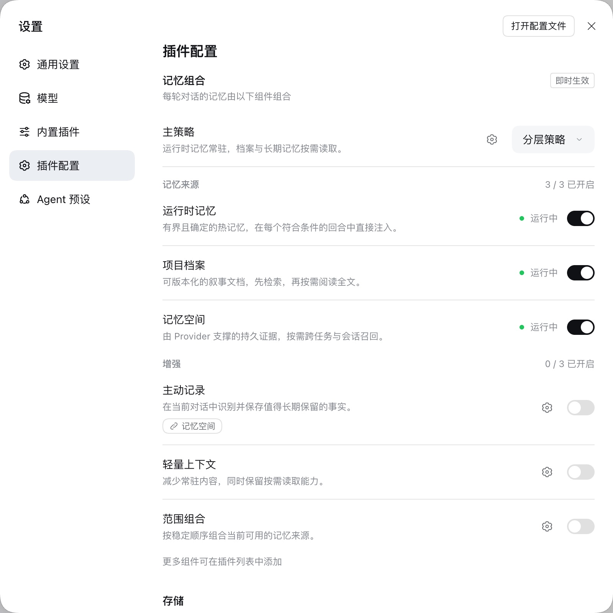
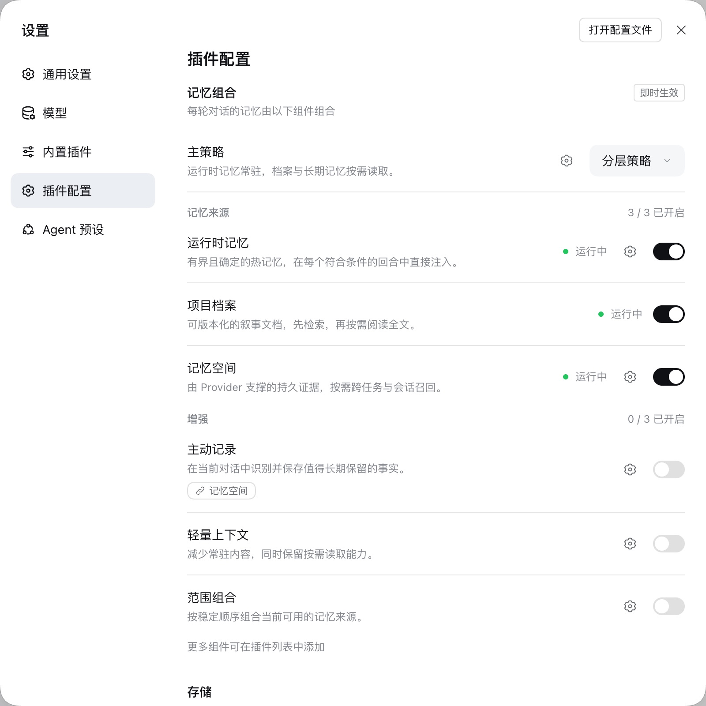
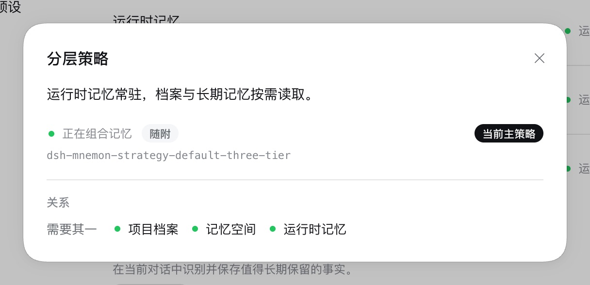
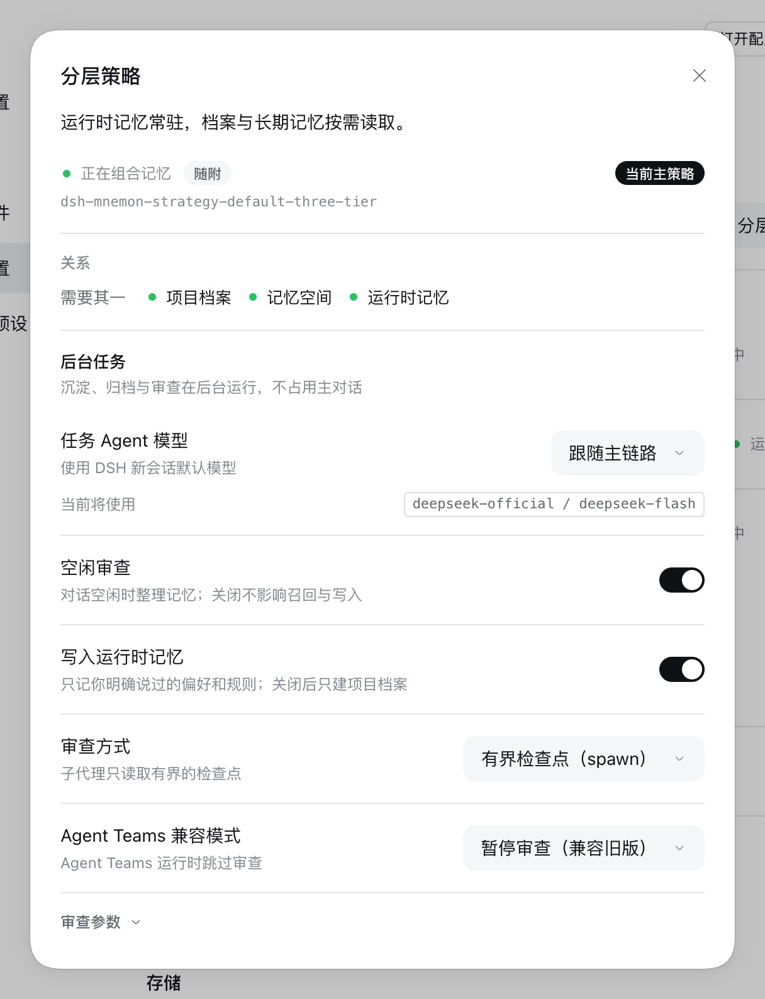
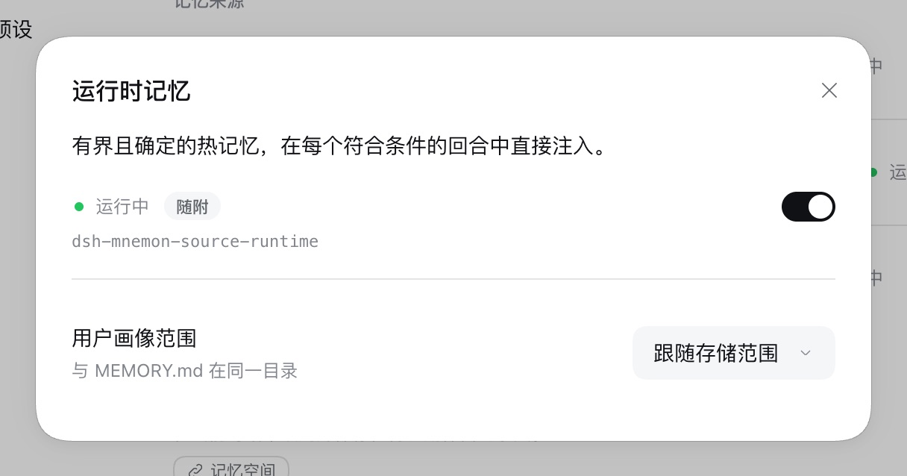

# 外壳绘制配置页时的组件设置 — issue #340

[English](./README.md) | [Issue #340](https://github.com/omdsh-dev/dsh-mnemon/issues/340) | [验证记录](./verification.json)

Issue 比较了进入 dsh-mnemon 配置页的两条路径：从记忆系统打开 DSH 的插件页，以及设置下的**插件配置**分区。后一条路径中，**运行时记忆**和**记忆空间**没有齿轮按钮，主策略页面也缺少设置。DSH 0.2.0-rc.2 本身没有这个设置分区，它来自一个把插件配置放进自己设置页的外壳；这样的外壳绘制配置页时不经过 DSH 的 slot 渲染器。

基线：main `2296898d`（dsh-mnemon 0.5.24）。修复：`90bf2e89`。运行环境为 macOS 15.6 arm64、Node 24.19.0、隔离前缀中的 DSH 0.2.0-rc.2（npm `latest` 与 `next`），以及 Mnemon CLI 0.2.10。

## 方法

[测试用插件](./mnemon-settings-embed-fixture/lib/client.js)像这类外壳一样，在 DSH 的设置中加入**插件配置**分区。它把 dsh-mnemon 的 `plugins.bundle.config` 条目原样镜像到自己的 slot 中（组件、语言和服务都相同），并以页面视图渲染。DSH 照常绑定服务，但镜像条目没有声明子 slot，所以页面拿不到 `renderSlot`。同一个截图脚本分别在修复版本和基线上运行；基线是本分支把修复改动的客户端文件换回 main 的版本，因为 main 的 `serve-e2e.mjs` 还没有 `--plugin=` 参数：

```sh
pnpm e2e:serve --plugin=docs/pr-assets/issue-340-settings-outside-slots/mnemon-settings-embed-fixture
```

1. 打开**插件**和 dsh-mnemon 页面，列出记忆组合中的齿轮按钮；
2. 打开**设置**，再打开**插件配置**，再次列出齿轮按钮；
3. 在设置分区中打开运行时记忆、记忆空间和主策略“分层策略”的齿轮；也从插件页打开分层策略。

## 修复前后

| main 上的“设置 → 插件配置” | 修复后 |
|---|---|
|  |  |

| main 上从设置分区打开的分层策略 | 修复后 |
|---|---|
|  |  |

修复后，运行时记忆的齿轮会打开它的页面，其中有**用户画像范围**：



| | main | 修复后 |
|---|---|---|
| DSH 插件页上的齿轮 | 6 个：分层策略、运行时记忆、记忆空间、主动记录、轻量上下文、范围组合 | 同样 6 个 |
| 设置分区中的齿轮 | 4 个：缺少运行时记忆和记忆空间 | 与插件页相同的 6 个 |
| 从设置分区打开的分层策略 | 只有关系 | 关系与**后台任务**，与插件页一致 |
| 浏览器控制台错误 | 无 | 无 |

## 原因与修复

运行时记忆、记忆空间和分层策略把各自的设置注册到 dsh-mnemon 配置页声明的区域中，以包名为键。组合面板为有声明选项或已注册设置的组件显示齿轮，已注册的设置通过 DSH 交给配置页的 `renderSlot` 渲染。没有 `renderSlot` 时，配置页无法渲染它们，于是直接略过：两个 Source 失去了进入各自页面的唯一入口，策略页面失去了后台任务。策略自己声明的选项仍然显示，所以还有一部分齿轮按钮。

DSH 的组件行页面本来就会遇到同样的情况（子 slot 只有一个声明方），它通过 `renderContributed` 直接渲染已注册的组件。现在配置页的服务也包含 `renderContributed`。只要 DSH 提供了 `renderSlot`，页面仍然优先使用它，所以 DSH 插件页的渲染与之前完全相同。

## 自动化检查

- `tests/client-plugin-page.spec.tsx`：有 DSH 的 `renderSlot` 时，已注册的设置通过它渲染；没有时通过 `renderContributed` 渲染；两者都没有时页面没有这些设置，与 main 相同。
- `tests/client-apply.spec.ts`：配置页的服务包含 `renderContributed`。这项断言在 main 上失败。

## 限制

Issue 没有说明是哪个外壳；DSH 0.2.0-rc.2、官方桌面版和 npm alpha 版都没有**插件配置**设置分区。夹具复现了报告的现象及其机制，也就是在没有 DSH `renderSlot` 的情况下渲染配置页；以其他方式渲染配置页的外壳可能需要单独检查。截图只覆盖 DSH 默认浅色主题和中文界面。
