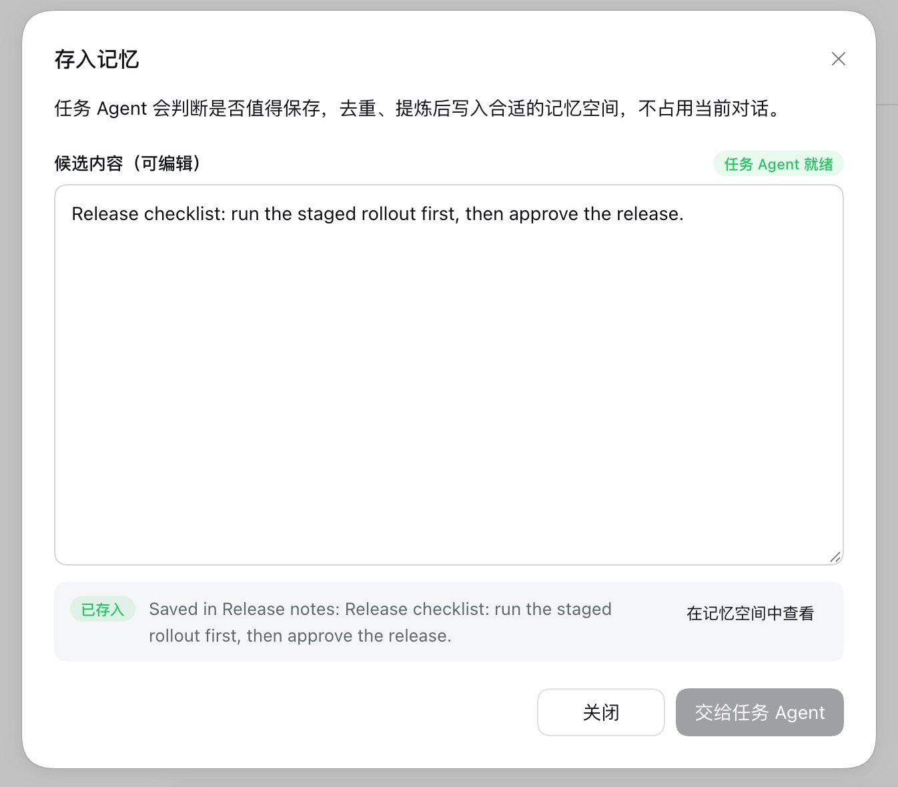
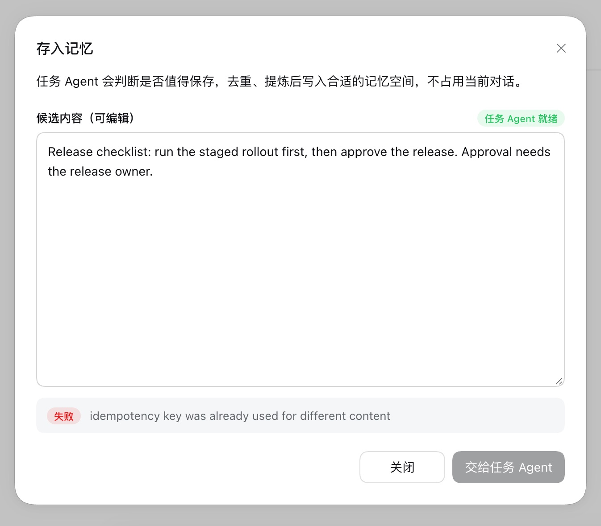
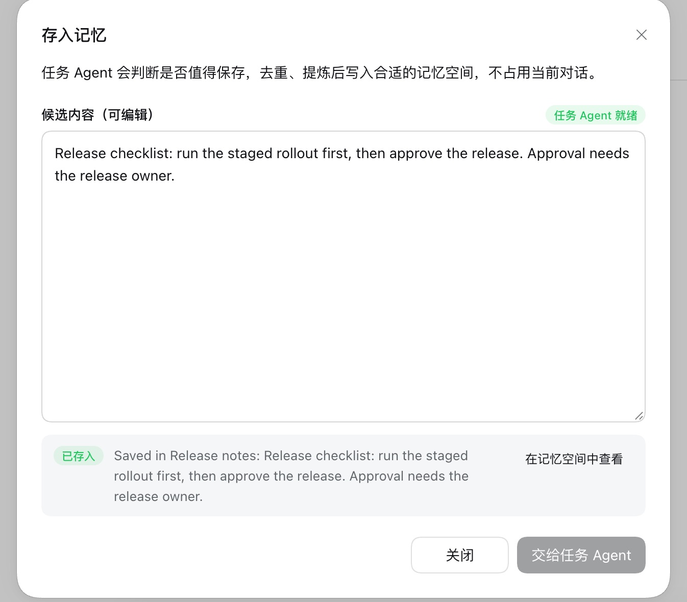

# 修改候选内容后再次存入记忆 — issue #342

[English](./README.md) | [Issue #342](https://github.com/omdsh-dev/dsh-mnemon/issues/342) | [验证记录](./verification.json)

存入记忆把候选内容标为可编辑；出现回执后，要修改候选内容才能再次提交。在 main 上，同一条回复保存过一次之后，修改候选内容再提交会报 `idempotency key was already used for different content`，什么也没有写入。修复后，修改后的内容会交给任务 Agent，同样存入。

基线：main `2296898d`（dsh-mnemon 0.5.24）。修复：`aaaa3ffa`。运行环境为 macOS 15.6 arm64、Node 24.19.0、隔离前缀中的 DSH 0.2.0-rc.2（npm `latest` 与 `next`），以及 Mnemon CLI 0.2.10。

## 方法

`pnpm e2e:serve --save-action` 用临时 profile、数据目录和本机回环模型启动真实 WebUI。只有模型的决策是脚本化的：每轮对话都收到一条值得保存的回复；任务 Agent 读取记忆空间目录，没有空间时创建一个 Native 空间，写入收到的候选内容并汇报 Provider 回执。对话框、Host 工具和 Native 写入都是真实运行。同一个脚本分别在 main 和修复版本上运行：

1. 发送一条消息，回复是夹具的发布清单；
2. 点击回复下的**存入记忆**，把候选内容删到第一句，交给任务 Agent；
3. 修改已有回执的候选内容，再次提交；
4. 用 `mnemon --readonly recall --basic` 读取 Native 存储。

## 修复前后

两个版本的第一次提交都会存入：

| main 上提交修改后的候选内容 | 修复后 |
|---|---|
|  |  |

| | main | 修复后 |
|---|---|---|
| 第二次回执 | **失败**，`idempotency key was already used for different content` | **已存入**修改后的候选内容 |
| 任务 Agent 写入次数 | 1 | 2 |
| 之后的 Native 存储 | 只有第一句 | 第一句与修改后的候选内容 |
| 浏览器控制台错误 | 无 | 无 |

## 原因与修复

对话框把回复的消息 id 作为请求的幂等键发送。Host 按作用域和键各保留一条重放记录，文本不同就拒绝这个键。对话框本身已经把修改后的候选内容当作新请求：一份回执只对应一段文本，文本一改，提交按钮就恢复可用。只有第一次提交成功之后，Host 才与对话框不一致，因为失败的提交会删除它的重放记录。

现在重放键还包含文本的 SHA-256 摘要。原样再次提交（例如重新打开对话框之后）仍返回第一次的回执，不会再启动一个任务 Agent；修改后的文本是一个独立的请求。重放保护仍最多保留 256 条记录，请求失败时仍会删除对应记录。不带键的提交（例如记忆空间页上的**存入记忆**）不受影响。

## 自动化检查

- `tests/lifecycle.spec.ts` 的 *treats an edited candidate for the same message as a request of its own*：修改后的候选内容会作为第二次写入交给任务 Agent，原样再次提交第一段文本则重放其结果、不再写入。在 main 上这条测试以报告中的错误失败。
- 原有的重放测试仍然检查：同一段文本的两次并发提交只启动一个任务 Agent。

## 限制

任务 Agent 是脚本化的，所以回执显示的是夹具的摘要，而不是真实模型的判断。运行只使用了中文界面；改动在 Host 中，对所有语言生效。
