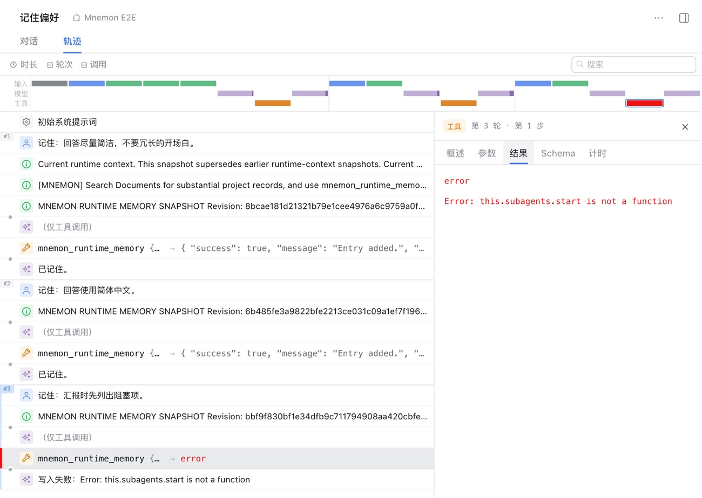
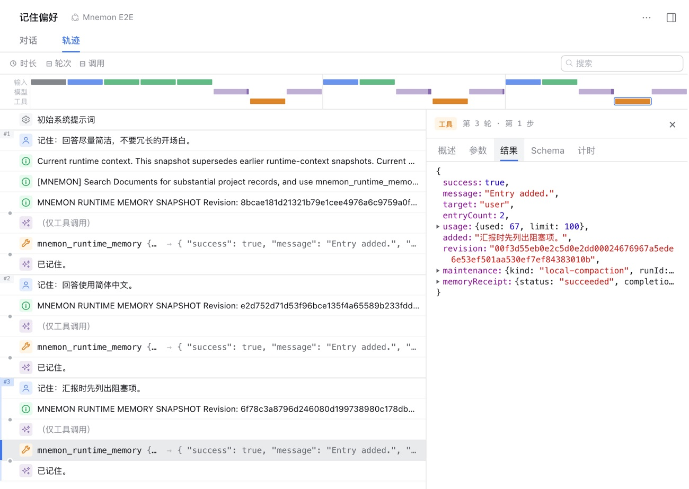
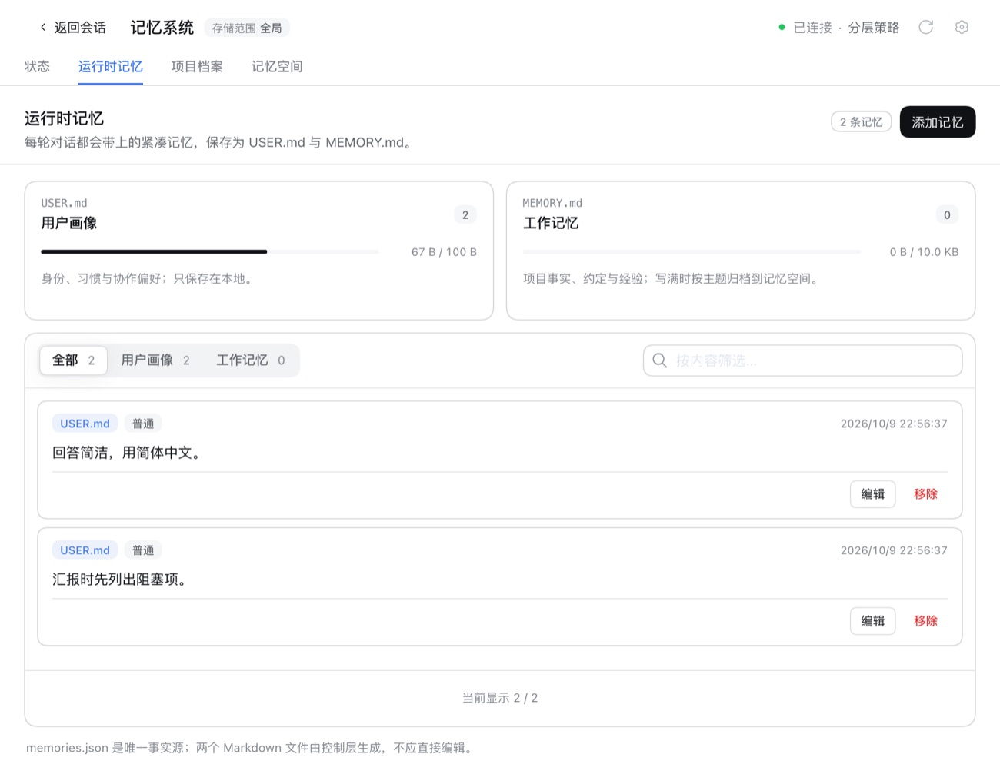
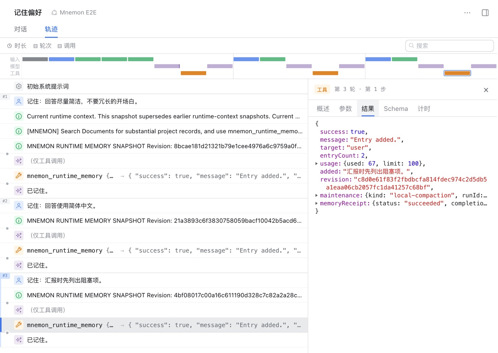

# DSH 0.2.1-alpha.2 上的记忆子 Agent — issue #356

[English](./README.md) | [Issue #356](https://github.com/omdsh-dev/dsh-mnemon/issues/356) | [验证记录](./verification.json)

Issue #356 报告：在 DSH 0.2.1-alpha.2 上，每次用 `mnemon_runtime_memory` 向用户画像添加或替换条目，都会报 `this.subagents.start is not a function`。同一个 dsh-mnemon 0.5.25 在 0.2.1-alpha.1 上正常，读取也一直正常。修复后，这次写入在 0.2.1-alpha.2 上成功，DSH 0.2.0 上的行为不变。

基线：main `76532791`（dsh-mnemon 0.5.25 加 #335）。修复：`3acc6cf6`。运行于 2026-10-09（Asia/Shanghai）：
- macOS 15.6 arm64，Node 24.19.0；
- headless Chrome 154，1280×900，zh-CN，浅色；
- DSH 0.2.1-alpha.2（npm `alpha`，即报告中的版本）与 0.2.0-rc.2（npm `latest` 与 `next`），各自装在独立的 npm 前缀中。

## 原因

- DSH 0.2.1-alpha.2 移除了 `ctx.subagents.start(name, request)`，连同 `startContinuable` 一起。0.2.0-rc.2 与 0.2.1-alpha.1 仍然两者都有。
  - 现在所有子 Agent 都通过 `startActivation({ provider, label, request, signal, delivery })` 启动，返回 `{ childId, messageId, result, dispose }`。
  - 它的 spawn 与 fork 两个 provider 只负责准备可续接的子 Agent。
- Mnemon 的每个记忆子 Agent 都用 `start` 启动，在 0.2.1-alpha.2 上还没创建子 Agent 就会抛错。涉及：
  - USER.md 压缩与工作记忆归档路由；
  - 空闲审查、存入记忆以及其他委派写入；
  - 记忆空间选择、项目档案归档与元数据维护；
  - 证据回答与整理记忆。
- 报告者的 USER.md 已满，所以每次写入用户画像都需要压缩，于是都失败了。读取以及放得下的写入不会启动子 Agent，所以一直正常。

## 修复

`src/host/subagent-start.ts` 中的 `startSubagent` 按当前 DSH 提供的接口启动子 Agent：
- DSH 提供 **`startActivation`** 时，用它启动，并设置 `delivery: 'caller'`。
  - 结果像原来的一次性运行一样回到 Mnemon。
  - DSH 不会向对话发送完成通知，也不会在子 Agent 的提示里追加“用 send_message 汇报”的说明。
- activation 的 signal 只覆盖启动阶段，所以启动之后的取消会销毁子 Agent，这与原来取消一次性运行的效果相同。
- DSH Agent 注册表中的子 Agent 在核对父 Agent 之后，代替原来运行对象上的 `localAgent`。空闲审查的工具守卫与失败详情都要读取它。
- DSH 提供 **`start`** 时，照旧用它启动，所以 DSH 0.2.0 与 0.1.7 的行为完全不变。
- 两个接口都没有时，错误信息会直接说明这一点，而不是抛出 `TypeError`。

## 方法

`pnpm e2e:serve --profile-compaction` 用临时 profile 启动真实 WebUI，USER.md 上限为 100 字节；`MNEMON_E2E_DSH` 指定要测试的 DSH 版本。在 Mnemon E2E 对话中发送三条消息，每条保存一项用户偏好：
1. `记住：回答尽量简洁，不要冗长的开场白。` 占用 48 字节；
2. `记住：回答使用简体中文。` 之后为 79 / 100 字节；
3. `记住：汇报时先列出阻塞项。` 放不下。Host 启动压缩子 Agent，先合并已保存的两条，再加入新条目。

只有模型的选择是脚本化的；工具、子 Agent、其结果工具和 Runtime 写入都是真实运行。每次运行之后，再打开对话**轨迹**中的第三次调用，以及运行时记忆页面。

## 修复前后

| | DSH 0.2.0-rc.2 | DSH 0.2.1-alpha.2 |
|---|---|---|
| main | 本地压缩后写入成功 | **失败**，`Error: this.subagents.start is not a function`；USER.md 仍是原来两条（79 B） |
| 修复后 | 本地压缩后写入成功 | 本地压缩后写入成功；USER.md 为合并后的一条加新条目（67 B） |

main 在 DSH 0.2.1-alpha.2 上，即报告中的失败：

| 修复后，DSH 0.2.1-alpha.2 | 之后的 USER.md |
|---|---|
|  |  |

在 DSH 0.2.0-rc.2 上，修复版本与 main 一样通过 `start` 启动子 Agent：

所有运行都没有浏览器控制台错误。由于采用 caller 方式交付，对话中不会出现子 Agent 的完成通知，每一轮都以模型自己的回复结束。

## 真实宿主测试

仓库中那些在进程内构建真实 DSH 宿主的测试，也分别在两个已发布版本上运行。DSH 的包被映射到对应安装；开发基线本身仍是 DSH 0.1.7-rc.2。

| 真实宿主测试文件（共 17 个测试） | main，0.2.1-alpha.2 | 修复后，0.2.1-alpha.2 | 修复后，0.2.0-rc.2 |
|---|---|---|---|
| `runtime-compaction-host`（新增）：spawn 子 Agent 压缩已满的 USER.md | 1 个失败 | 1 个通过 | 1 个通过 |
| `review-user-turn-host`：带 #327 恢复的 fork 与 spawn 审查 | 4 个失败 | 4 个通过 | 4 个通过 |
| `review-evidence-host`：fork 与 spawn 审查，原生与 Code Mode，拒绝自有作用域工具 | 4 个失败 | 4 个通过 | 4 个通过 |
| `agent-team-review-host`：Team 审查矩阵 | 1 个失败 | 1 个通过 | 1 个通过 |
| `async-subagent-host`：调用 Mnemon 检索的可续接子 Agent | 2 个通过 | 2 个通过 | 2 个通过 |
| `subagent-token-usage-host` | 5 个通过 | 5 个通过 | 5 个通过 |

main 上的 10 个失败全部是 `this.subagents.start is not a function`。有三处调整源于 DSH 0.2.1-alpha.2 本身，与修复无关；第一项真实的 DSH profile 本来就会提供：
- 它的子 Agent 运行时依赖工作目录服务，后者又依赖 `fs`，所以测试环境加载了这两个服务；
- 工具模式 `both` 已移除，所以 Code Mode 用例让根作用域保持 `native`，子 Agent 仍以 Code Mode 呈现；
- 在 Code Mode 下，它会在派发前拒绝 `run_code` 中被过滤的工具。因此 Team 用例看到的是失败的 `run_code` 调用，而不是失败的 `spawn_teammate` 调用。两个版本上 Team 工具都从未执行。

## 自动化检查

- `tests/subagent-start.spec.ts` 覆盖：
  - 以 caller 方式交付的 activation，以及 DSH 期望的请求结构；
  - 只有父 Agent 拥有时才使用注册表中的子 Agent；
  - 启动之后与启动过程中的取消，以及子 Agent 结束之后不再销毁；
  - DSH 0.2.0 上 `start` 不变，以及两个接口都没有时的错误。
- `tests/subagent.spec.ts` 在只有 activation 的 DSH 上覆盖 USER.md 压缩、带工具守卫的 fork 审查，以及失败子 Agent 的有界错误信息。这三个测试在 main 上都以报告中的错误失败。
- `tests/runtime-compaction-host.spec.ts` 是新增的真实宿主测试，CI 在锁定的 DSH 0.1.7-rc.2 上运行它。
- `tests/dsh-host-compatibility.spec.ts` 加入 0.2.1-alpha.2；现有 peer 范围在包含预发布版本时已经接受它。

## 限制

- 模型是脚本化的，所以合并后的条目是夹具写好的内容。
- WebUI 运行只覆盖 USER.md 压缩。其他委派任务使用同一个启动入口，由上面的真实宿主测试覆盖。
- DSH 0.2.1-alpha.2 是 alpha 版本，activation 接口在进入 release candidate 之前仍可能变化。届时如果 DSH 两个接口都不提供，会得到明确的错误，而不是 `TypeError`。
