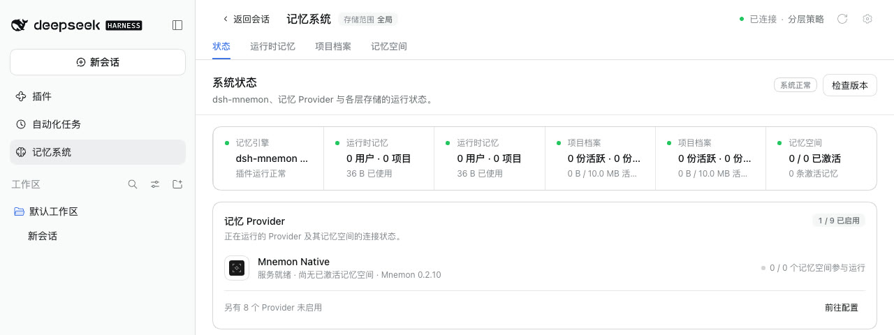
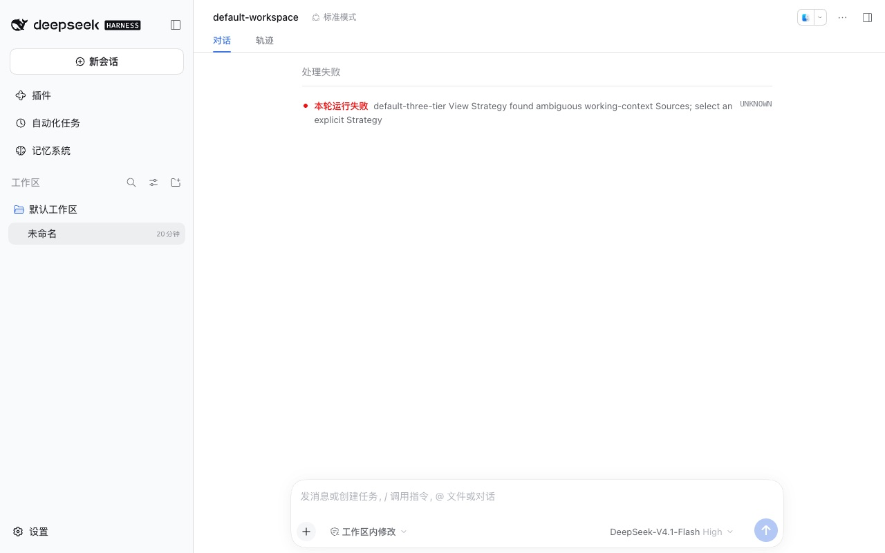
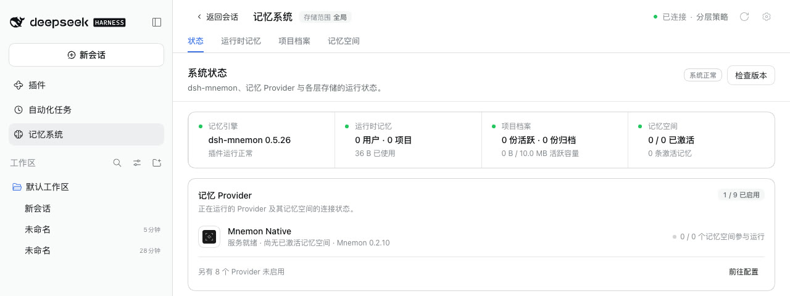
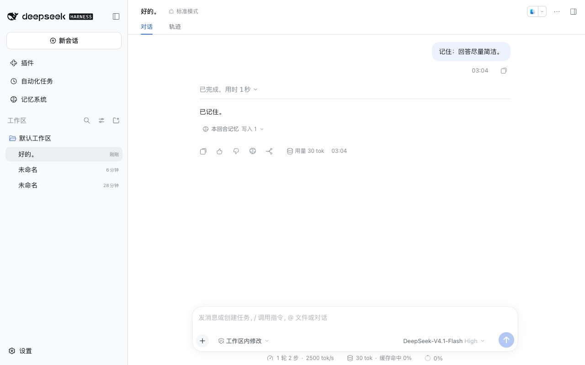
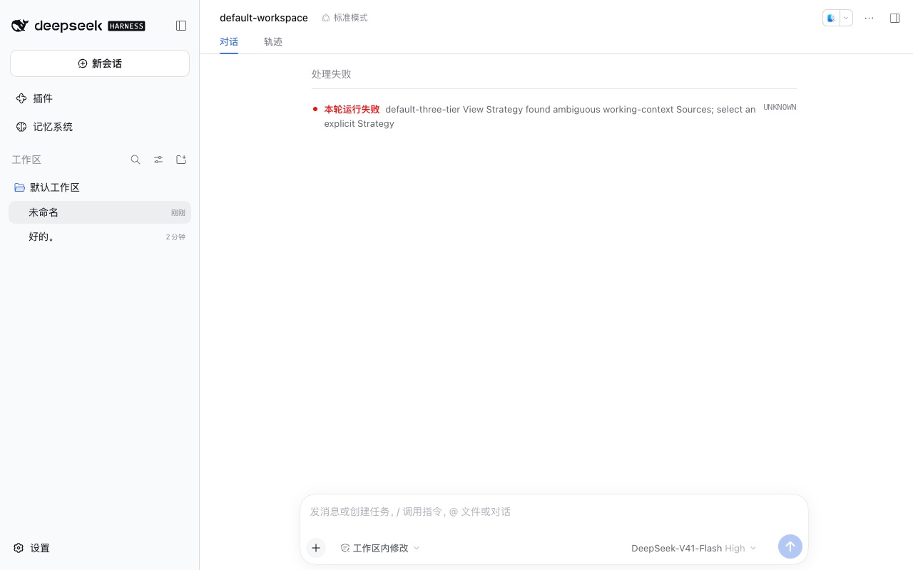
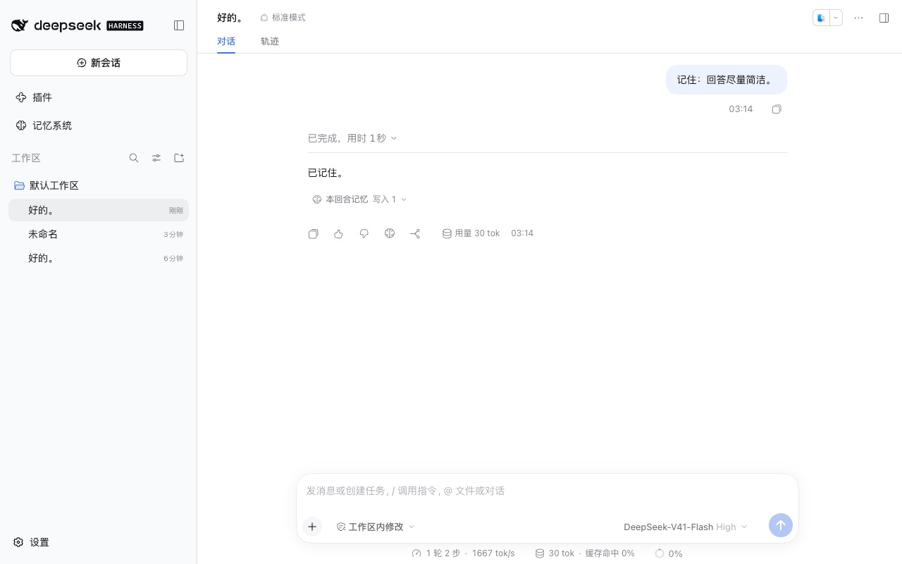

# dshmarket 仅客户端挂载下的记忆 Source — issue #359

[English](./README.md) | [Issue #359](https://github.com/omdsh-dev/dsh-mnemon/issues/359) | [验证记录](./verification.json)

Issue #359 报告：在 DSH 0.2.1-alpha.2 上，使用 dsh-mnemon 0.5.26、记忆空间 0.5.17 与 dshmarket 1.66.14 时，每次启动 `dsh web` 都提示条目 `mkt-client-dsh-mnemon-source-memory-spaces` 以 `Memory Spaces requires at least one explicit Provider child` 失败，而 Profile 中的记忆空间条目明明列出了五个 Provider。这条警告来自 dshmarket，而不是 DSH 0.2.1-alpha.2：在 DSH 0.2.0-rc.2 上同样出现。运行时记忆与项目档案也单独安装时，同一种挂载会把它们再加载一次，之后每一轮对话都会失败。修复后，两个 DSH 版本上都不再出现这些问题。

基线：报告中的 npm 版本 dsh-mnemon 0.5.26 与记忆空间 0.5.17（main `7bd96593`）。修复：`58d19c24`；审查后的跟进提交 `af350e1a` 不改变这些运行涉及的行为。运行于 2026-10-10（Asia/Shanghai）：
- macOS 15.6 arm64，Node 24.19.0；
- headless Chrome 154，1280×800，zh-CN，浅色；
- DSH 0.2.1-alpha.2（npm `alpha`，即报告中的版本）与 0.2.0-rc.2（npm `latest` 与 `next`），各自安装在独立的 npm 前缀中；
- dshmarket 1.66.14，即报告中的版本，也是 npm 上的最新版本。

## 原因

- dshmarket 启动时，`mountClientOnlyDeps` 会检查 Profile 中声明了 `dsh.client`、没有 `dsh.bundle`、且不属于 Profile bundle 的直接依赖。除非 dshmarket 已停用该包，或 Profile 自己的 `cordis.patch.yml` 提到了它，它都会在自己的 Include 树中为其写入一行 `mkt-client-<包名>`。这一行本应加载一个空的宿主模块，让 DSH 为该包提供客户端 bundle。
- 本应替换为空模块的那段逻辑比较的是裸包名，而它写入的行里是包解析后的 `file://` URL。两者永远对不上，于是 Loader 导入了包真正的宿主模块，并在没有配置的情况下执行它。我们检查过的每个 dshmarket 1.66 版本都有这个问题，从 1.66.0（2026-09-25）到 1.66.14（2026-10-08）。
- dsh-mnemon 中只有运行时记忆、项目档案与记忆空间符合这条规则：它们带客户端，又不是 bundle。Starter 通过自己的条目组合这三个 Source，所以 Profile 中另外单独安装的副本（检查版本中显示为“Profile 独立维护”）会被多挂载一次。
- 三个 Source 在这次挂载中的表现：
  - 记忆空间拿不到任何 Provider，于是抛错，DSH 把它打印为报告中的启动警告。
  - 运行时记忆与项目档案各注册了第二个实例。状态页因此把它们的卡片显示两次，默认的分层策略也拒绝在有两个工作上下文 Source 时组合视图，每一轮都以 `default-three-tier View Strategy found ambiguous working-context Sources; select an explicit Strategy` 失败。
- Profile 自己那个带 Provider 的记忆空间条目从未受影响：在下文 DSH 0.2.0-rc.2 上复现报告的场景 A 中，对话依然拿到了记忆空间的工具。
- DSH 的 Loader 会在条目 id 前加上父条目的 id，所以这次挂载的 id 是 `include:dsh-market:mkt-client-<包名>`。

## 修复

- Starter 扩展 SDK 中的 `installMemory`：当 Loader 条目 id 的最后一段以 `mkt-client-` 开头时，无论插件传入什么 `instanceId`，都不安装任何内容。运行时记忆与项目档案通过已安装的 Starter 调用它，所以它们已发布的版本只需更新 Starter 即可修复。
- 记忆空间在这样的条目下，会在解析 Provider 之前从 `apply` 返回。它自己读取 Loader，而不是依赖新的 SDK 导出，所以新版本在旧版 Starter 上同样有效。
- Starter 自己的条目照旧组合三个 Source；dshmarket 仍然挂载它的那一行，只是这一行现在什么也不做。

## 方法

每个 DSH 版本使用全新的 home、DSH home 与 pnpm store，各有一个 Profile：
1. **场景 A，即报告中的情况。** `dsh plugin --profile web add dsh-mnemon@0.5.26 dshmarket@1.66.14 dsh-mnemon-source-memory-spaces@0.5.17`。
2. **场景 B。** 在场景 A 的基础上，再单独安装 `dsh-mnemon-source-runtime@0.5.14` 与 `dsh-mnemon-source-documents@0.5.10`。
3. **修复。** 用 `dsh plugin --profile web add` 安装从修复打包的 Starter 与记忆空间。它们保留原来的版本号 0.5.26 与 0.5.17。

每次都通过 `dsh web` 启动，并使用本机回环的模型桩。在新对话中发送 `记住：回答尽量简洁。`，模型桩会调用真实的 `mnemon_runtime_memory` 工具保存这条偏好。只有模型的选择是脚本化的。

## 修复前后

| | DSH 0.2.0-rc.2 | DSH 0.2.1-alpha.2 |
|---|---|---|
| 场景 A，npm 版本 | 两次启动都有警告；状态正常；对话保存了偏好 | 启动时有警告；状态正常 |
| 场景 B，npm 版本 | 状态页把运行时记忆与项目档案各显示两次；**对话失败** | 与 0.2.0-rc.2 相同 |
| 场景 A，修复 | 两次启动均无警告；对话保存了偏好 | 两次启动均无警告；对话保存了偏好 |
| 场景 B，修复 | 每张卡片各一张；对话保存了偏好 | 每张卡片各一张；对话保存了偏好 |

两个 DSH 版本上 npm 版本的启动警告（路径已缩写）：

```text
dsh: warning: 1 entry did not activate
mkt-client-dsh-mnemon-source-memory-spaces (file://<profile>/node_modules/dsh-mnemon-source-memory-spaces/lib/index.js): Error: Memory Spaces requires at least one explicit Provider child
    at resolveMemorySpaceProviderEntries (file://<profile>/node_modules/dsh-mnemon-source-memory-spaces/lib/index.js:3756:39)
    ...
    at file://<profile>/.dsh-market/#mkt-client-dsh-mnemon-source-memory-spaces
    at file://<profile>/#dsh-market
```

在场景 B 中，记忆空间的这次挂载同样失败，但在我们的运行中 DSH 没有为它打印警告。

DSH 0.2.1-alpha.2 上场景 B 的 npm 版本：

| 状态页 | 对话 |
|---|---|
|  |  |

同一个 Profile 安装修复后：

| 状态页 | 对话 |
|---|---|
|  |  |

DSH 0.2.0-rc.2 上场景 B 修复前后：

| npm 版本 | 修复 |
|---|---|
|  |  |

所有运行都没有浏览器控制台错误。

## 自动化检查

- `tests/composable-extension-sdk.spec.ts`：在 `include:dsh-market:mkt-client-<包名>` 下，无论不传 `instanceId`、传入空白值还是插件自选的值，`installMemory` 都不会在 Starter 条目之外再安装任何内容。只在较早的段中带有该前缀的条目照常安装。
- `tests/market-client-shim.spec.ts`：先在 Starter 的条目下挂载真实的运行时记忆、项目档案与记忆空间插件，再按 dshmarket 的方式在没有配置的情况下各挂载一次。第二次挂载的运行时记忆与项目档案不增加 Source，默认的分层策略仍能组合一轮视图；第二次挂载的记忆空间不增加 Source，也不抛错。普通条目下的第二个运行时记忆仍是第二个实例，记忆空间在普通条目下仍然要求 Provider。
- `plugins/dsh-mnemon-source-memory-spaces/tests/source.spec.ts`：记忆空间在 dshmarket 条目下保持静默，在其他条目下仍然要求 Provider。
- 在基线上，这些测试以用户实际遇到的错误失败：对话以 `found ambiguous working-context Sources` 失败，记忆空间抛出 `requires at least one explicit Provider child`，SDK 用例则注册了挂载处的 Source。只改 Starter 时，记忆空间的用例仍然抛错；只改记忆空间时，其余用例仍然失败。如果匹配时忽略条目 id 的前缀，它们同样失败。这正是本修复第一版的问题：它在没有前缀的测试 id 下通过，却在真实 Profile 中失效。

## 局限

- dshmarket 的替换逻辑仍然有问题；本修复只是让 dsh-mnemon 的 Source 在其下保持静默。其他带客户端、又不是 bundle 的第三方包，在那里仍会加载宿主模块。
- 自己维护记忆空间的 Profile，在 dshmarket 挂载处加载的仍是其已安装的记忆空间版本。只有该包更新到 0.5.18 或更高版本后，警告才会消失：宿主的 PATH 上有 pnpm 时可在**检查版本**中更新，否则运行 `dsh plugin --profile <profile> add dsh-mnemon-source-memory-spaces@0.5.18`，也可以移除这个副本。运行时记忆与项目档案只需更新 Starter。
- 修复是从保留旧版本号的打包文件安装的。发布验收会安装正式发布的版本。
- 只在 macOS 上运行；报告来自 Windows。原因与修复都与平台无关。
