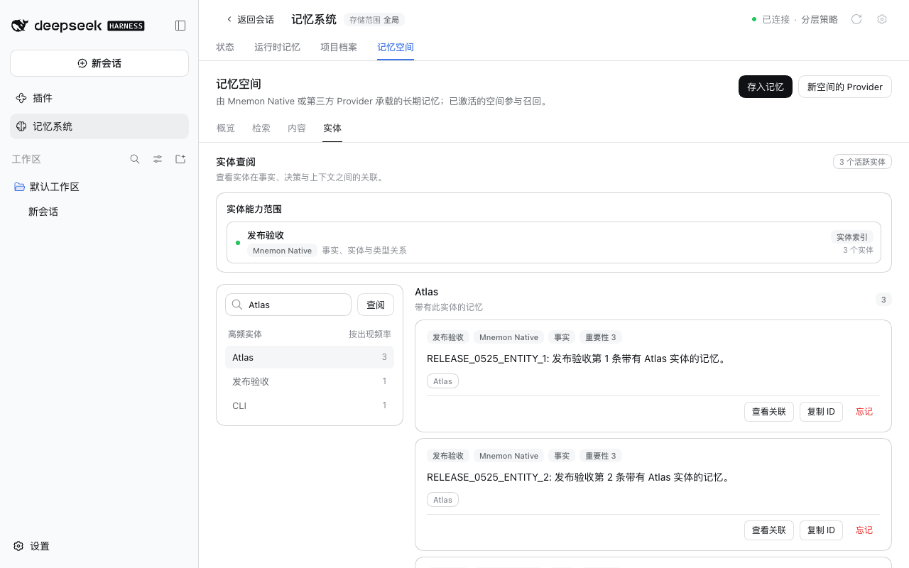

# v0.5.25 发布验收

[English](README.md)

验证于 2026-10-08（Asia/Shanghai）。被测包是 0.5.25 改动的六个包，由 `pnpm release:version` 基于包含 #343 至 #349 的 `main` `d89a67f6` 构建：`dsh-mnemon@0.5.25`、`dsh-mnemon-source-runtime@0.5.13`、`dsh-mnemon-source-documents@0.5.10`、`dsh-mnemon-source-memory-spaces@0.5.17`、`dsh-mnemon-strategy-default-three-tier@0.5.8` 与 `dsh-mnemon-provider-mnemon-native@0.5.9`。其余 12 个组件包按 Starter 锁定的版本从 npm 安装，0.5.25 没有改动它们。

## DSH 0.2.0-rc.2 上的真实官方 WebUI

在未修改的 npm DSH `0.2.0-rc.2`（npm `latest` 与 `next`）上，使用 Node `24.19.0`，以及全新的 home、DSH home 与 pnpm store：

1. 在未安装 Mnemon 的情况下启动宿主，打开**插件 → 添加插件**。
2. 安装 `dsh-mnemon`。安装源由 DSH 自行选择，测速后选中了中国大陆镜像源。一个本地回环 registry 返回 npm 的真实元数据，并加上六个新版本。之后 profile 中是这六个新版本，其余组件都是 npm 上锁定的版本。
3. 点击**立即启用**，记忆系统无需重启宿主即出现。[状态页](status.png)显示 **dsh-mnemon 0.5.25 / 系统正常**，Mnemon Native 显示 **Mnemon 0.2.10**。
4. 添加一条运行时记忆，刷新页面后读回：[运行时记忆](runtime.png)。
5. 在 WebUI 中创建并激活一个 Mnemon Native 空间：[记忆空间](spaces.png)。用 Mnemon CLI `0.2.10` 写入一条事实并用 CLI 召回，再用 WebUI 的**直接检索**找到同一条事实：[检索](recall.png)。
6. 用 CLI 再写入三条带有实体 `Atlas` 的记忆，以及一条只在正文中提到 Atlas 的记忆。在**实体**页，`Atlas` 计数为 3，选中后正好列出这三条（“当前显示 3 / 3”）。相关记忆收在**查找相关记忆**后面：[实体](entities.png)。点击后找到了只提到 Atlas 的那条记忆，按钮变为**收起**：[相关记忆](entities-related.png)。
7. 打开**检查版本**。dsh-mnemon 显示已安装 0.5.25。发布前 npm 上的最新版本仍是 0.5.24，因此对话框把 0.5.25 标为本地版本，不提供更新。**立即启用**后没有出现重启提示，因为正在运行的就是已安装的版本。

宿主通过了全部步骤，没有宿主警告或控制台错误，宿主进程只启动了一次。[validation.json](validation.json) 记录了包摘要与各项结果。profile 与记忆均为合成数据。DSH 0.1.7-rc.2 不再纳入发布验收。

## 本版本包含的修复

每项修复另有修复前后记录：
- [没有记忆空间时的记忆](../issue-336-archive-without-space/README.zh-CN.md)（#345）
- [保存到记忆的位置](../save-action-destination/README.zh-CN.md)（#349）
- [修改后再次提交的候选](../issue-342-edited-save/README.zh-CN.md)（#343）
- [按 id 遗忘](../issue-337-exact-id-actions/README.zh-CN.md)（#346）
- [归档的跳过回执](../issue-339-archive-receipt-evidence/README.zh-CN.md)（#347）
- [只查看的检索](../issue-338-inspection-reads/README.zh-CN.md)（#348）
- [DSH slot 之外的设置](../issue-340-settings-outside-slots/README.zh-CN.md)（#344）

## 校验与发布边界

`pnpm run release:check` 确认 Starter 0.5.25 使用 `latest` 标签，并锁定五个新的组件版本；发布时根据上一个版本计算变更的包。没有插件使用 Starter 新增的 SDK 导出，因此 peer 下限不变。版本号变更使 lockfile 中 11 行 specifier 改变，CI 使用的 pnpm 10.13.1 以 `--frozen-lockfile` 接受它。

发布 PR 与发布工作流都会运行完整的工作区校验与打包插件校验。发布流程随后：
- 冻结合并后的 main 版本；
- 发布变更的包并从 npm 读回；
- 安装完整的 18 个包组合，并验证一次真实的 Registry 升级；
- 创建 GitHub release。

这些截图展示的是带版本号的本地包，本身并不证明 npm 发布已经完成。
