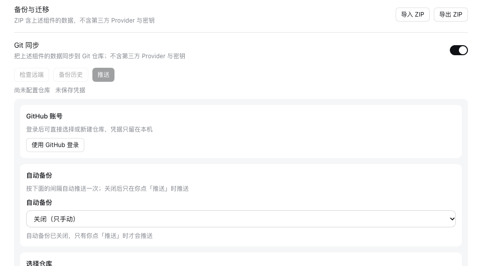

# v0.5.26 release acceptance

[中文](README.zh-CN.md)

Verified on 2026-10-09 (Asia/Shanghai). The packages under test are the two that 0.5.26 changes, as `pnpm release:version` builds them from `main` `d295f52d`, which includes #335 and #357: `dsh-mnemon@0.5.26` and `dsh-mnemon-source-runtime@0.5.14`. The other 16 component packages come from npm at the Starter's pinned versions, which 0.5.26 does not change.

## Real official WebUI on DSH 0.2.0-rc.2 and 0.2.1-alpha.2

Each host is unmodified npm DSH, run with Node `24.19.0` and a fresh home, DSH home and pnpm store: `0.2.0-rc.2` (npm `latest` and `next`) and `0.2.1-alpha.2` (npm `alpha`). Every step passed on both.

1. Started the host without Mnemon installed and opened **Plugins → Add plugin**.
2. Installed `dsh-mnemon`. DSH chose the install source itself; its speed check picked the mainland China mirror. A loopback registry answered with npm's real metadata plus the two new versions. The profile then held each new version, with every other component at its pinned npm version.
3. Clicked **Enable now**; the Memory System appeared without a host restart. Status reports **dsh-mnemon 0.5.26 / System nominal**, and Mnemon Native names **Mnemon 0.2.10**: [0.2.0-rc.2](status.png), [0.2.1-alpha.2](status-alpha.png).
4. Added a Runtime memory entry and read it back after reloading the page: [Runtime](runtime.png).
5. Created a Mnemon Native space in the WebUI and activated it on its card: [Memory Spaces](spaces.png). Wrote a fact with Mnemon CLI `0.2.10`, recalled it with the CLI, then found the same fact with the WebUI's **Direct search**: [Recall](recall.png).
6. Wrote three more memories with the CLI that carry the entity `Atlas`, and one that only mentions Atlas. On **Entities**, `Atlas` counts 3, and selecting it lists exactly those three ("Showing 3 / 3"). Related memories stay collapsed behind **Find related memories**: [Entities](entities.png). Pressing it found the memory that only mentions Atlas: [Related memories](entities-related.png).
7. On the dsh-mnemon configuration, **Git sync** is off: the row shows only its title and the switch. Turning it on shows the repository, **Sign in with GitHub** and **Automatic backup**, off by default, and turning it off again hides them: [off](sync-off.png), [on](sync-on.png).
8. Opened **Check versions**. dsh-mnemon lists 0.5.26 as installed. Before publication npm's latest is still 0.5.25, so the dialog marks 0.5.26 as a local version and offers no update for it. No restart notice appeared after **Enable now**, since the version that runs is the one installed.

Neither host logged a host warning or console error, and each host process was started once. [validation.json](validation.json) has the package digests and the results. Profiles and memories are synthetic.

## The changes in this release

Each change has its own record:
- [Git repository sync](../git-sync/README.md) (#335)
- [Memory subagents on DSH 0.2.1-alpha.2](../issue-356-subagent-activation/README.md) (#357): writing to a full USER.md in the WebUI on both hosts, on main and with the fix, and the real-host subagent tests on both

## Validation and release boundary

`pnpm run release:check` confirms the Starter 0.5.26 on the `latest` tag with its new Runtime Memory pin; publication computes the changed packages from the previous release. The Starter's public entries are unchanged since v0.5.25, so no peer floor moves. The version bump changes two specifier lines in the lockfile, and pnpm 10.13.1, the CI version, accepts it with `--frozen-lockfile`. The package measures 1,851,881 unpacked bytes, within 10% of the 2,000,000-byte ceiling, so this release raises the ceiling to 2,500,000.

The release pull request and the publication workflow run the complete workspace and packed-plugin verification. Publication then:
- freezes the merged main revision;
- publishes the changed packages and reads them back from npm;
- installs the complete 18-package combination and checks a real Registry upgrade;
- creates the GitHub release.

These screenshots show the versioned local packages; they do not by themselves certify npm publication.
