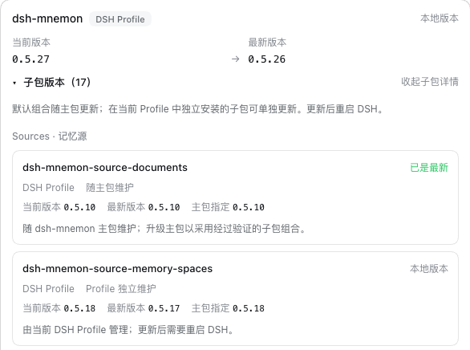

# v0.5.27 发布验收

[English](README.md)

验证于 2026-10-10（Asia/Shanghai）。被测的是 0.5.27 改动的两个包，由 `pnpm release:version` 基于 `main` `6a0b5da6`（包含 #360 与 #361）构建：`dsh-mnemon@0.5.27` 与 `dsh-mnemon-source-memory-spaces@0.5.18`。其余 16 个组件包按 Starter 锁定的版本从 npm 安装，0.5.27 没有改动它们。

两个宿主都是未经修改的 npm DSH，使用 Node `24.19.0`，以及全新的 home、DSH home 与 pnpm store：`0.2.0-rc.2`（npm `latest` 与 `next`）和 `0.2.1-alpha.2`（npm `alpha`）。本机回环 registry 返回 npm 的真实元数据，并加上两个新版本。每一步在两个宿主上都通过。

## 在官方 WebUI 中全新安装

1. 启动未安装 Mnemon 的宿主，打开**插件 → 添加插件**。
2. 安装 `dsh-mnemon`。安装源由 DSH 自己选择，测速后选中了中国大陆镜像源。之后 profile 中是两个新版本，其余组件都是 npm 上锁定的版本。
3. 点击**立即启用**，无需重启宿主即出现记忆系统。状态页显示 **dsh-mnemon 0.5.27 / 系统正常**，Mnemon Native 显示 **Mnemon 0.2.10**：[0.2.0-rc.2](status.png)、[0.2.1-alpha.2](status-alpha.png)。
4. 添加一条运行时记忆，刷新页面后读回：[运行时记忆](runtime.png)。
5. 在 WebUI 中创建一个 Mnemon Native 空间，并在卡片上激活：[记忆空间](spaces.png)。用 Mnemon CLI `0.2.10` 写入一条事实并用 CLI 召回，再用 WebUI 的**直接检索**找到同一条：[检索](recall.png)。
6. 再用 CLI 写入三条带有实体 `Atlas` 的记忆，以及一条只在正文中提到 Atlas 的记忆。**实体**页上 `Atlas` 计数为 3，并恰好列出这三条；**查找相关记忆**找到了只提到 Atlas 的那条：[实体](entities.png)、[相关记忆](entities-related.png)。
7. 打开**检查版本**。dsh-mnemon 显示已安装 0.5.27。发布前 npm 的最新版本仍是 0.5.26，所以对话框把 0.5.27 标为本地版本，不提供更新。

## issue #359 中的环境，从 v0.5.26 更新

1. 在启动 WebUI 之前，用命令行装好报告者的环境：`dsh plugin --profile web add dsh-mnemon@0.5.26 dshmarket@1.66.14 dsh-mnemon-source-memory-spaces@0.5.17`，于是记忆空间由 Profile 独立维护。
2. 启动 DSH：它提示 `mkt-client-dsh-mnemon-source-memory-spaces` 未能激活（`Memory Spaces requires at least one explicit Provider child`），与 issue 的报告一致。状态页显示系统正常，每个 Source 各一张卡片。
3. 按发布说明中针对 PATH 上没有 pnpm 的宿主给出的方式更新两个包：`dsh plugin --profile web add dsh-mnemon@0.5.27 dsh-mnemon-source-memory-spaces@0.5.18`。发布前检查版本无法提供这两个候选版本，因为它向 npm 查询最新版本。
4. 重启 DSH。没有再出现警告，状态页显示 **dsh-mnemon 0.5.27 / 系统正常**，每个 Source 各一张卡片；检查版本显示记忆空间 0.5.18 由 Profile 独立维护，与 Starter 锁定的版本一致：[更新后的检查版本](update-versions.png)。

两个宿主都没有控制台错误；除第 2 步中的警告外，也都没有宿主警告。[validation.json](validation.json) 记录了包摘要与结果。Profile 与记忆均为合成数据。

## 本版本的改动

每项改动都有自己的记录：
- [dshmarket 仅客户端挂载下的记忆 Source](../issue-359-market-client-shim/README.zh-CN.md)（#360）：两个宿主上修复前的启动警告、重复的状态卡片与失败的对话，以及修复后均不再出现
- [DSH 0.2.1-alpha.2 上的 dsh-mnemon](../dsh-021-alpha2/README.zh-CN.md)（#361）：在两个已安装宿主上运行全部根测试、真实宿主测试、Headless 与激活契约，在 0.2.1-alpha.2 上检查 WebUI 各流程，并在两个宿主上检查在插件页切换 Provider

## 验证与发布边界

`pnpm run release:check` 确认 Starter 0.5.27 发布到 `latest` 标签，并锁定新的记忆空间版本；发布流程会根据上一版本计算需要发布的包。记忆空间没有使用新的 Starter SDK 导出，peer 下限仍为 `dsh-mnemon ^0.5.19`。版本号变更只改动 lockfile 中两行 specifier，CI 使用的 pnpm 10.13.1 以 `--frozen-lockfile` 接受它。包解压后为 1,856,213 字节，低于 2,500,000 字节上限。

发布 PR 与发布工作流会运行完整的工作区验证和打包插件验证。之后发布流程会：
- 冻结合并后的 main revision；
- 发布有变化的包，并从 npm 读回；
- 安装完整的 18 包组合，检查一次真实的 Registry 升级；
- 创建 GitHub Release。

发布后还会在两个宿主上用检查版本从 npm 更新 #359 中的环境。

这些截图展示的是带版本号的本地包，本身并不证明 npm 发布成功。
