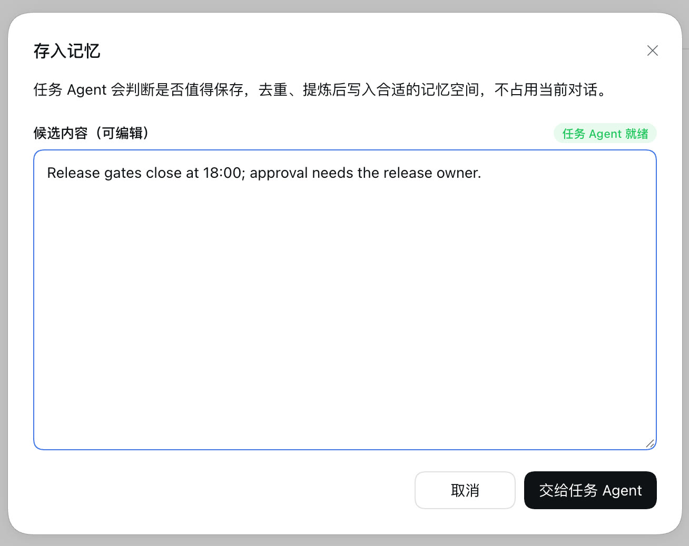
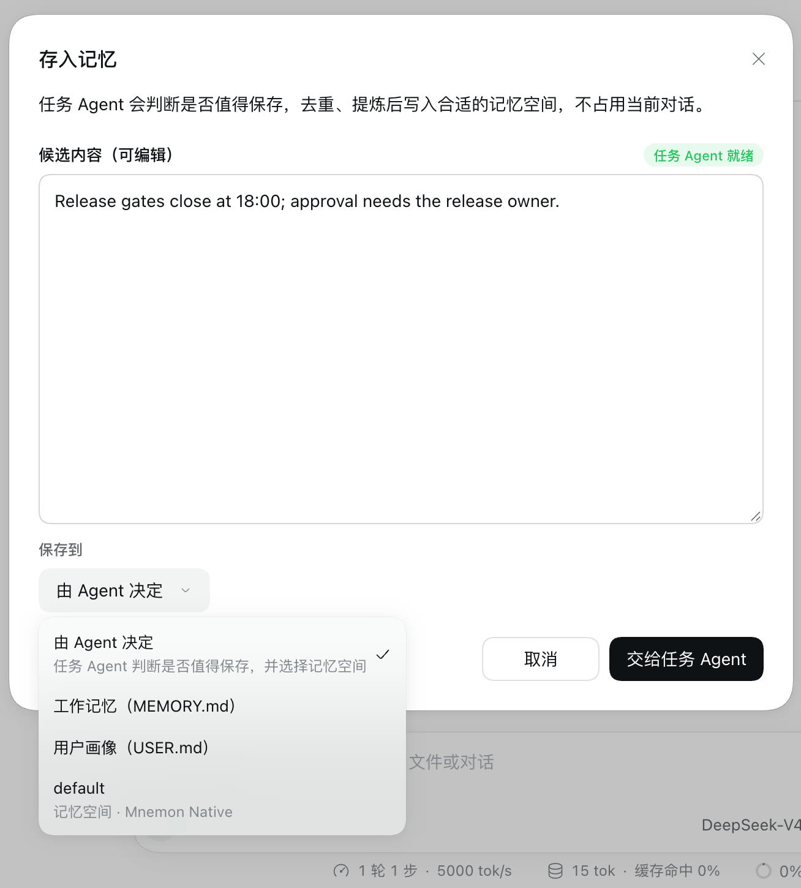
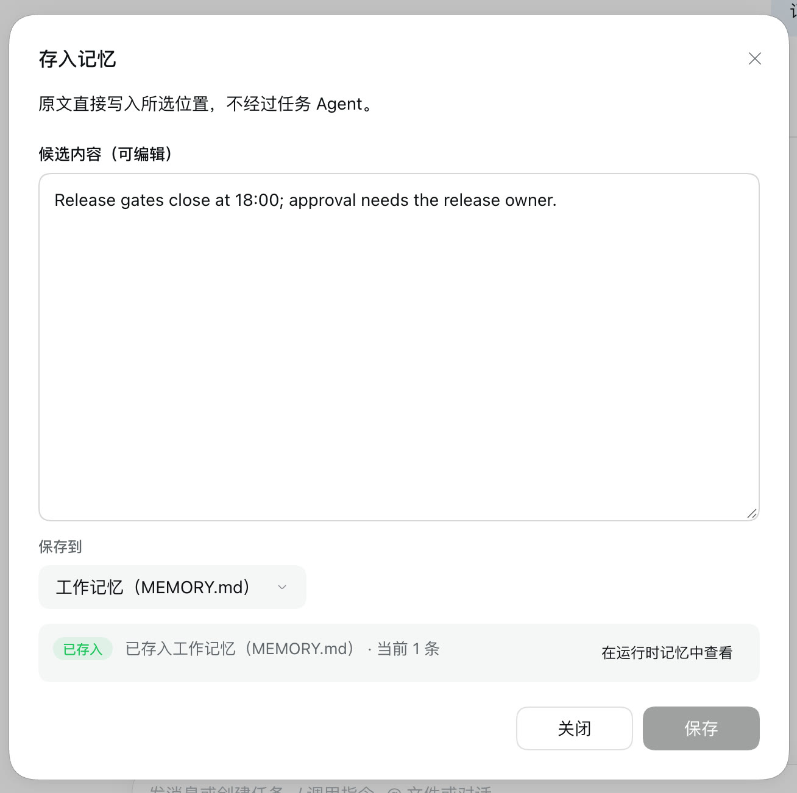
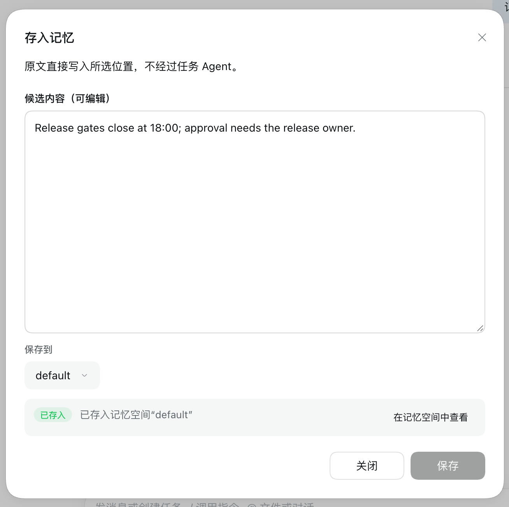
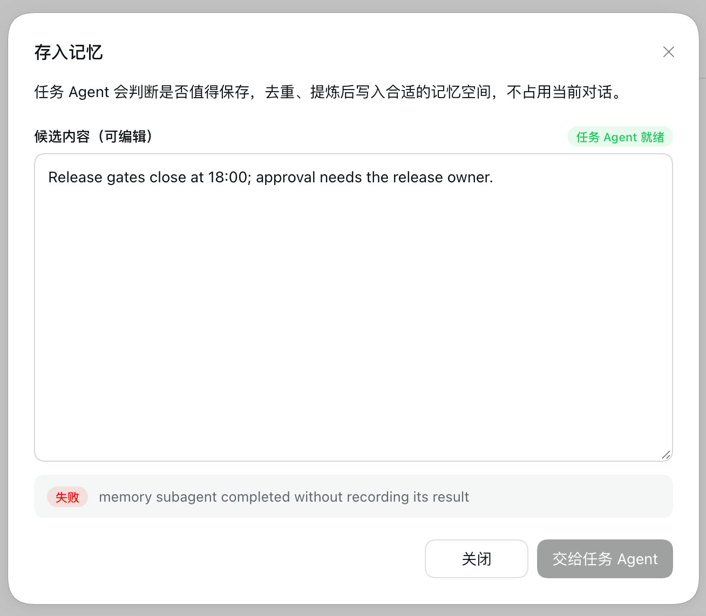
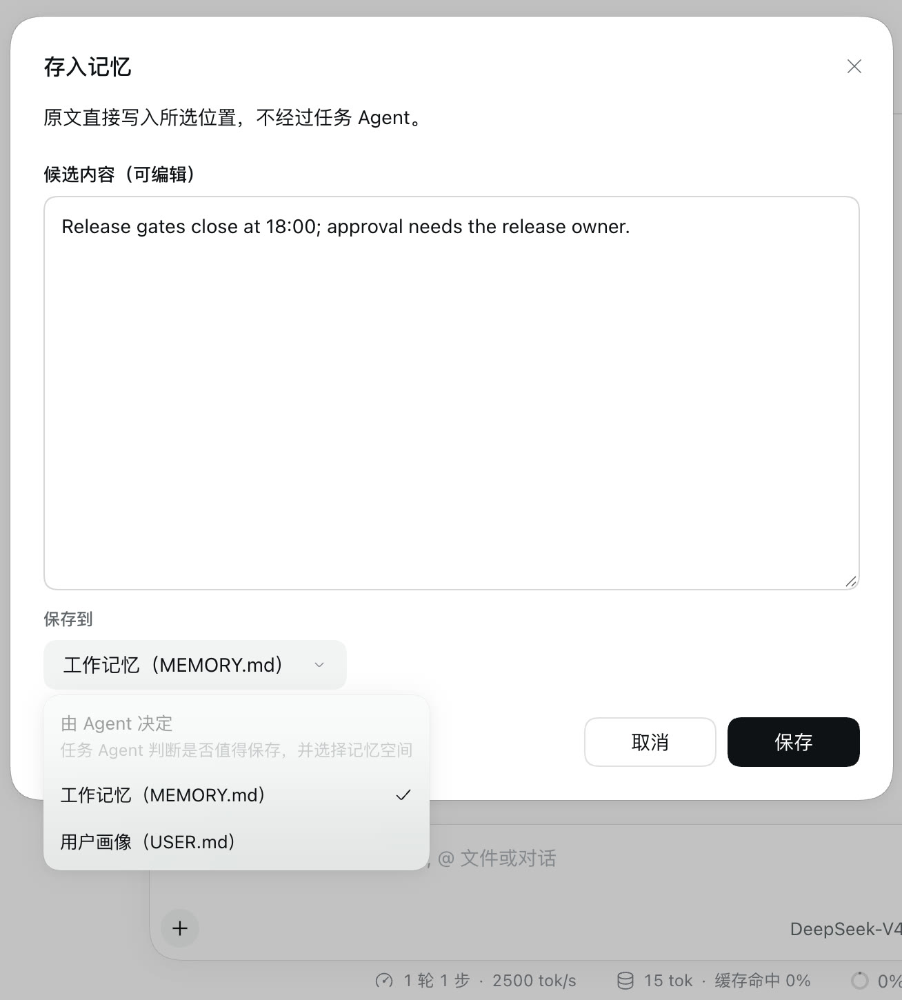

# Save to memory: choose where it goes

[简体中文](./README.zh-CN.md) | [Verification record](./verification.json)

**Save to memory** on a reply always handed the text to a task Agent, which decides whether it is worth keeping and picks a Memory Space. A reply could not go straight into working memory or the user profile. Without a Memory Space Provider the task Agent had nowhere to write, yet the dialog still said it was ready, and sending failed. The dialog now has **Save to**: **Let the Agent decide** stays the default while a task Agent can write, and **Working memory (MEMORY.md)**, **User profile (USER.md)** and each Memory Space by name take the text as it is, at once, without a task Agent.

Baseline: main `2296898d` (dsh-mnemon 0.5.24). Change: the commit this record ships with. The runs use macOS 15.6 arm64, Node 24.19.0, DSH 0.2.0-rc.2 in an isolated prefix and headless Chrome at 1280 × 860, device scale 2, in Chinese and the light theme.

## Method

`pnpm e2e:serve` ran with the loopback model stub in two setups:

- **With a Provider**: Mnemon CLI 0.2.10, and a Native space `default` seeded with four memories before the Host starts.
- **Without a Provider**: one `mnemon` configuration row whose `cliPath` points at a missing file, which hides any installed Mnemon CLI as `--without-mnemon-cli` does. No other Provider is connected.

The same script ran on the change and, with main's versions of the client files the change touches swapped into the same build, on the baseline:

1. Send a message, hover the reply and click **存入记忆** (Save to memory).
2. Replace the candidate with one sentence.
3. On main, read the dialog. Without a Provider, click **交给任务 Agent** (Send to task Agent) and read the receipt.
4. With the change, open **保存到** (Save to) and read the choices. With a Provider, save to **工作记忆** (Working memory) and then to the space `default`. Without one, save to the place the dialog starts on.
5. Read `MEMORY.md` from the runtime data directory and the Native store with `mnemon --readonly recall`.

## Before and after

| Save to memory on main | With the change |
|---|---|
|  |  |

| Saved to working memory | Saved to the space `default` |
|---|---|
|  |  |

| Without a Provider, on main | With the change | Saved |
|---|---|---|
|  |  |  |

| | Main | Change |
|---|---|---|
| Choice of place | none: the task Agent picks a Memory Space | **保存到** (Save to): **由 Agent 决定** (Let the Agent decide, the default), **工作记忆（MEMORY.md）**, **用户画像（USER.md）**, and `default` · Memory Space · Mnemon Native |
| A reply into working memory | not possible | `MEMORY.md` holds the sentence word for word; the receipt reads "已存入工作记忆（MEMORY.md） · 当前 1 条" (Saved to working memory · 1 entry), with **在运行时记忆中查看** (View in Runtime Memory) |
| A reply into a chosen space | only through the task Agent | the Native store `default` holds the sentence word for word, beside the four seeded memories; the receipt reads "已存入记忆空间“default”" |
| Without a Provider | **任务 Agent 就绪** (Task Agent ready); sending fails with `memory subagent completed without recording its result` | the dialog starts on working memory; **由 Agent 决定** is listed, closed; saving writes `MEMORY.md` |
| Browser console errors | none | none |

## How it works

- **Let the Agent decide** keeps the request and receipt it had. It is the default while a task Agent can write there: one is available, the Memory Spaces layer is on, and a space exists or a Provider is ready to create one. Otherwise it stays listed, closed, and the dialog starts on working memory.
- A chosen place takes the text as it is, through that Source's own management operation with its current revision, as its page does: Runtime Memory's `add` for `MEMORY.md` and `USER.md`, with capacity maintenance when the file is full, and Memory Spaces' `remember` with `source: user` for a space. No model runs.
- Working memory and the user profile are listed while the Runtime Memory layer is on. Spaces are listed while the Memory Spaces layer is on and their Provider is enabled and can remember; a Mnemon Native space only while its CLI is found.
- A receipt answers one text in one place. The same text to the same place again needs an edit; another place takes it as it is, and so does a send that failed. Runtime Memory keeps one copy of an entry, and saving it again says so instead of failing.
- A status that does not say whether a layer, Provider or task Agent is there counts it as there, so the default never moves away from the task Agent by omission.

## Automated checks

`tests/client-interaction-surfaces.spec.tsx`:

- Without a task Agent the dialog starts on working memory, sends Runtime Memory's `add` with the fresh revision and confirmation, shows the receipt, and lists **Let the Agent decide** closed. No task Agent request is made.
- With a task Agent and two spaces, the Agent stays the default. A Native space is left out while its CLI is missing. A failed write to the chosen space can be sent again as it is. The receipt then closes sending for that place only, and its link opens Memory Spaces.
- The existing Save to memory tests keep the task Agent as the default and its request unchanged.

## Limits

- A chosen place does not judge, deduplicate across spaces or distil; that is what **Let the Agent decide** is for. Only Runtime Memory drops an exact duplicate.
- The dialog does not remember the last place; each dialog starts on the default.
- On main, a full working memory with no Memory Space refuses the write. The receipt then shows the refusal. The local archive for that case is a separate change (#345).
- Screenshots show DSH's default light theme and Chinese UI only.
